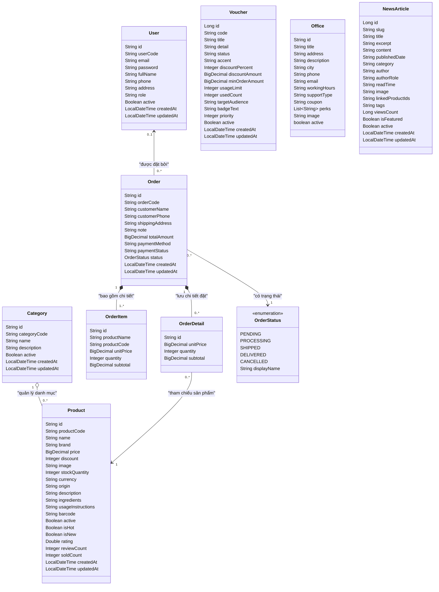

# Domain Model Class Diagram

Biểu đồ lớp mức Lĩnh vực (Domain Model Class Diagram) theo chuẩn phân tích thiết kế hướng đối tượng (OOAD), biểu diễn cấu trúc thực thể dữ liệu cốt lõi, thuộc tính và các mối quan hệ nghiệp vụ trong hệ thống thương mại điện tử PinkyCloud.

---

## 1. Biểu đồ Mermaid Class Diagram

---

## 2. Chi tiết các Thực thể và Quan hệ Nghiệp vụ

### 2.1. Phân hệ Người dùng & Quản trị (User Management)
- **`User`**: Đại diện cho người dùng hệ thống (Khách hàng `ROLE_CUSTOMER` hoặc Quản trị viên `ROLE_ADMIN`). Chứa định danh hệ thống (`id` dạng UUID) và mã nghiệp vụ (`userCode`).
- Quan hệ: Một `User` có thể đặt nhiều `Order` (`0..*`). Đơn hàng cũng hỗ trợ khách vãng lai (Guest Checkout) khi liên kết tới `User` là tùy chọn (`0..1`).

### 2.2. Phân hệ Danh mục & Sản phẩm (Catalog & Products)
- **`Category`**: Phân loại danh mục mỹ phẩm (Chăm sóc da, trang điểm, chăm sóc tóc, v.v.).
- **`Product`**: Thông tin chi tiết sản phẩm mỹ phẩm bao gồm giá, tồn kho, thành phần (`ingredients`), cách sử dụng (`usageInstructions`), đánh giá, nhãn giảm giá / hot / new.
- Quan hệ: Quan hệ Aggregation (`o--`) giữa `Category` (1) và `Product` (`0..*`).

### 2.3. Phân hệ Đơn hàng & Bán hàng (Order & Fulfillment)
- **`Order`**: Thông tin đơn hàng, tổng tiền, địa chỉ giao hàng, phương thức thanh toán (`COD`, v.v.), trạng thái thanh toán và trạng thái xử lý.
- **`OrderItem`**: Snapshot chi tiết từng món hàng tại thời điểm đặt (tên sản phẩm, mã, đơn giá, số lượng, thành tiền).
- **`OrderDetail`**: Thực thể liên kết giữa `Order` và `Product`.
- **`OrderStatus`**: Enum định nghĩa chu trình đơn hàng (`PENDING` -> `PROCESSING` -> `SHIPPED` -> `DELIVERED` / `CANCELLED`).
- Quan hệ: Quan hệ Composition (`*--`) giữa `Order` (1) và `OrderItem` (`1..*`), xóa đơn hàng sẽ xóa toàn bộ các item tương ứng.

### 2.4. Phân hệ Khuyến mãi, Chi nhánh & Tin tức (Marketing & Support)
- **`Voucher`**: Quản lý mã giảm giá theo %, số tiền cố định, điều kiện đơn tối thiểu và giới hạn lượt sử dụng.
- **`Office`**: Điểm chi nhánh/văn phòng tư vấn hỗ trợ khách hàng với danh sách đặc quyền (`perks`).
- **`NewsArticle`**: Bài viết tin tức làm đẹp, cẩm nang chăm sóc da, tác giả và gắn thẻ sản phẩm liên quan.
