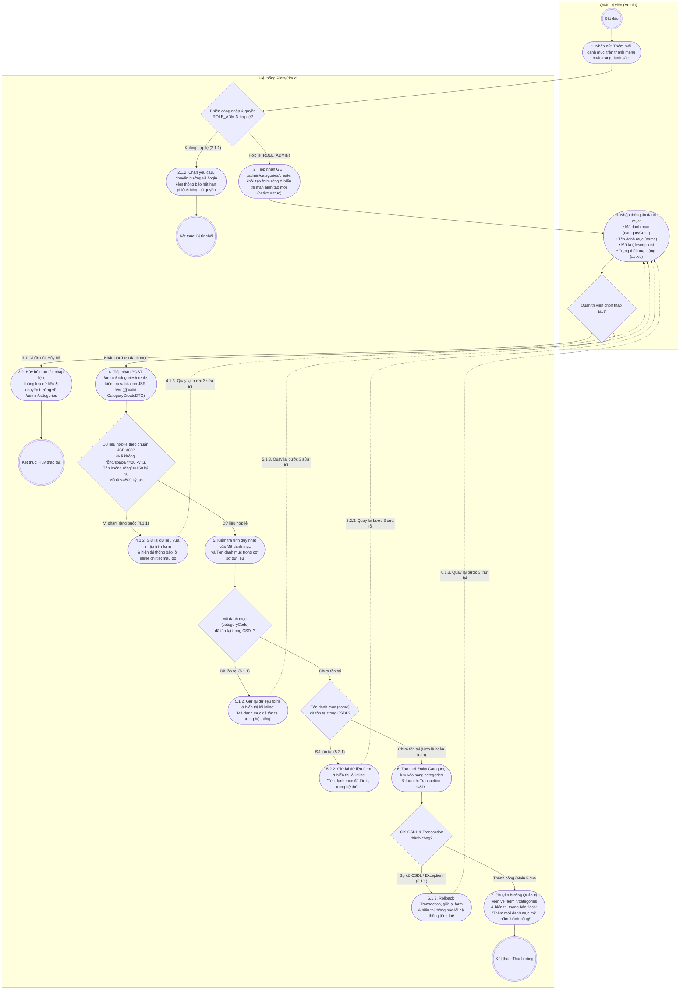

# SƠ ĐỒ HOẠT ĐỘNG (ACTIVITY DIAGRAM)
## USE CASE: QUẢN TRỊ VIÊN THÊM MỚI DANH MỤC MỸ PHẨM (`uc001a-admin-create-category`)

---

## 1. GIỚI THIỆU & NGUYÊN TẮC MÔ HÌNH HÓA

Sơ đồ Hoạt động (Activity Diagram) dưới đây mô tả chi tiết chuỗi hành động và tương tác phân làn (Swimlane) giữa **Quản trị viên (Admin)** và **Hệ thống PinkyCloud** trong quá trình tạo mới một danh mục mỹ phẩm.

- **Nguồn chân lý (Source of Truth):** Đặc tả ca sử dụng chi tiết [`docs/usecases/uc001a-admin-create-category.md`](file:///E:/java-www/www-programming/docs/usecases/uc001a-admin-create-category.md).
- **Mức độ bao phủ:** Phản ánh chính xác 1-1 Luồng sự kiện chính (Main Flow - các bước 1 đến 7), Luồng thay thế (Alternate Flow - bước 3.1 đến 3.3) và toàn bộ các Luồng ngoại lệ (Exception Flows - 2.1.1, 4.1.1, 5.1.1, 5.2.1, 6.1.1) kèm các vòng lặp điều chỉnh dữ liệu.

---

## 2. SƠ ĐỒ SWIMLANE ACTIVITY DIAGRAM (MERMAID UML)

---

## 3. BẢNG GIẢI THÍCH CHI TIẾT CÁC ĐIỂM RẼ NHÁNH & NGOẠI LỆ

| Điểm Rẽ Nhánh (Decision) | Điều Kiện Kiểm Tra | Hành Động Xử Lý & Phản Hồi Hệ Thống | Luồng Tương Ứng trong Đặc Tả |
| :--- | :--- | :--- | :--- |
| **`D_Auth`** | Kiểm tra quyền và tính hợp lệ của phiên làm việc. | **Không hợp lệ:** Chuyển hướng người dùng về trang `/login`, thông báo lỗi hết hạn phiên và chấm dứt tiến trình. **Hợp lệ:** Mở form tạo mới rỗng kèm trạng thái kích hoạt mặc định `active = true`. | Ngoại lệ `2.1.1` $\rightarrow$ `2.1.2` $\rightarrow$ `2.1.3` |
| **`D_Action`** | Thao tác lựa chọn của Quản trị viên trên Form. | **Hủy bỏ (3.1):** Hủy toàn bộ nội dung đang nhập, không ghi nhận xuống CSDL, điều hướng về danh sách `/admin/categories`. **Lưu danh mục:** Đóng gói payload gửi HTTP POST lên máy chủ. | Luồng thay thế `3.1` $\rightarrow$ `3.2` $\rightarrow$ `3.3` |
| **`D_JSR380`** | Kiểm tra cú pháp và độ dài chuỗi đầu vào theo tiêu chuẩn Bean Validation. | **Vi phạm (4.1.1):** Trả về view tạo mới, bảo lưu dữ liệu đã nhập, render thông báo lỗi màu đỏ ngay dưới từng ô input vi phạm; yêu cầu người dùng sửa đổi. **Hợp lệ:** Tiến hành kiểm tra nghiệp vụ tầng Service. | Ngoại lệ `4.1.1` $\rightarrow$ `4.1.2` $\rightarrow$ `4.1.3` (Loop về Bước 3) |
| **`D_CheckCode`** | Kiểm tra trùng lặp trường `categoryCode` trong bảng `categories`. | **Đã tồn tại (5.1.1):** Hiển thị lỗi inline tại trường mã danh mục: *"Mã danh mục '[code]' đã tồn tại trong hệ thống. Vui lòng chọn mã khác."* **Chưa tồn tại:** Tiếp tục bước kiểm tra trùng tên. | Ngoại lệ `5.1.1` $\rightarrow$ `5.1.2` $\rightarrow$ `5.1.3` (Loop về Bước 3) |
| **`D_CheckName`** | Kiểm tra trùng lặp trường `name` trong bảng `categories`. | **Đã tồn tại (5.2.1):** Hiển thị lỗi inline tại trường tên danh mục: *"Tên danh mục '[name]' đã tồn tại trong hệ thống. Vui lòng đặt tên khác."* **Chưa tồn tại:** Chuyển sang lưu trữ bản ghi. | Ngoại lệ `5.2.1` $\rightarrow$ `5.2.2` $\rightarrow$ `5.2.3` (Loop về Bước 3) |
| **`D_TxResult`** | Kiểm tra tính toàn vẹn Transaction khi thực thi INSERT xuống CSDL. | **Lỗi CSDL (6.1.1):** Tự động Rollback Transaction, không lưu rác dữ liệu, hiển thị cảnh báo: *"Không thể lưu danh mục vào lúc này. Vui lòng thử lại sau."* **Thành công:** Commit Transaction, chuyển hướng về `/admin/categories` kèm thông báo flash màu xanh. | Ngoại lệ `6.1.1` $\rightarrow$ `6.1.2` $\rightarrow$ `6.1.3` & Luồng chính Bước 6, 7 |
