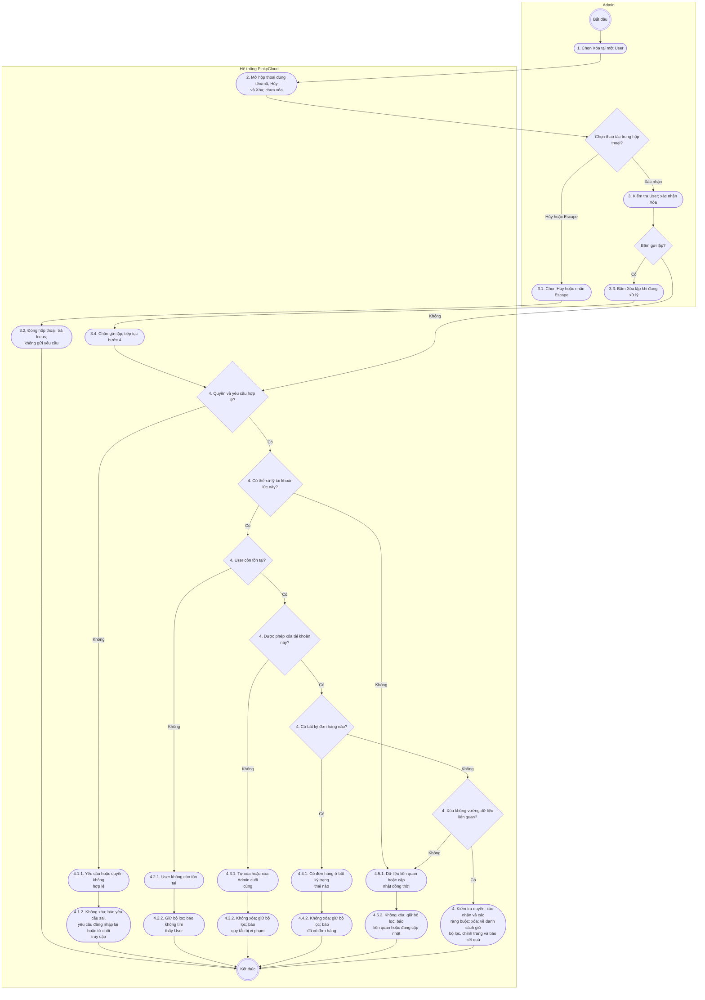

# Activity — Xóa người dùng

Đặc tả: [uc007c-admin-delete-user](../usecases/uc007c-admin-delete-user.md).

Các nút hành động giữ số bước của đặc tả; nút quyết định diễn giải điều kiện rẽ nhánh tại bước tương ứng. Đây là bản đối chiếu Mermaid để vẽ lại bằng UML Activity trong Visual Paradigm theo hướng dẫn nhóm.

## Đối chiếu bước

| Bước đặc tả | Nút Activity |
| --- | --- |
| 1 | `n1` |
| 2 | `n2` |
| 3 | `n3` |
| 4 | `n4` |
| 3.1 | `n3_1` |
| 3.2 | `n3_2` |
| 3.3 | `n3_3` |
| 3.4 | `n3_4` |
| 4.1.1 | `n4_1_1` |
| 4.1.2 | `n4_1_2` |
| 4.2.1 | `n4_2_1` |
| 4.2.2 | `n4_2_2` |
| 4.3.1 | `n4_3_1` |
| 4.3.2 | `n4_3_2` |
| 4.4.1 | `n4_4_1` |
| 4.4.2 | `n4_4_2` |
| 4.5.1 | `n4_5_1` |
| 4.5.2 | `n4_5_2` |
