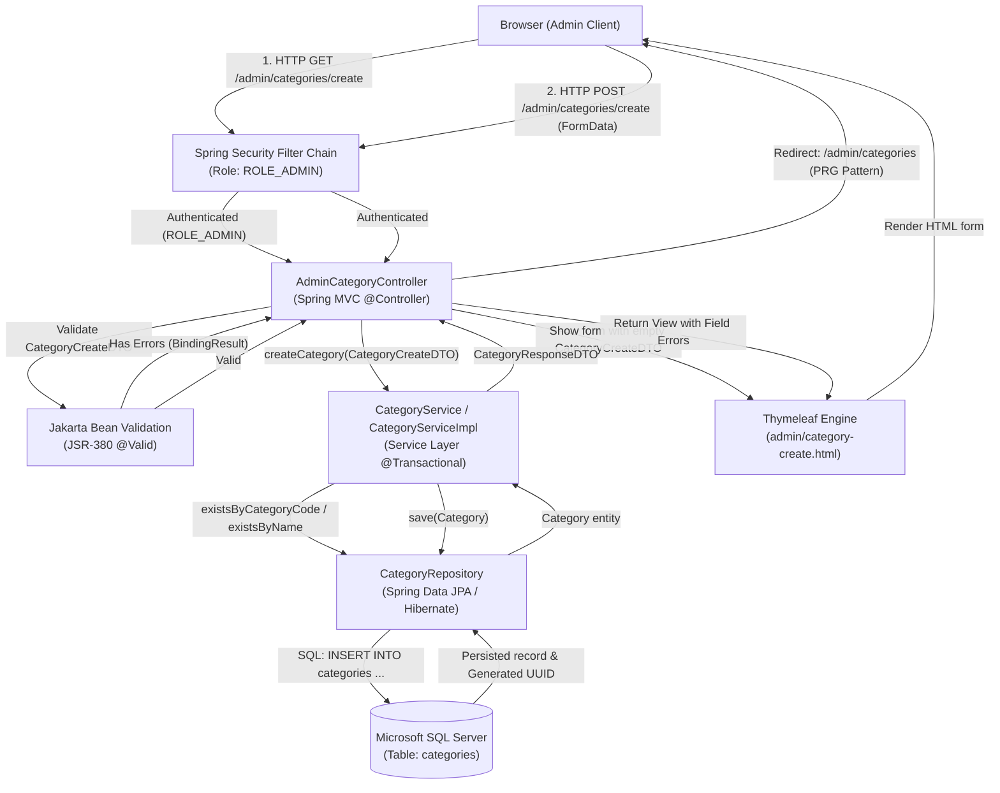
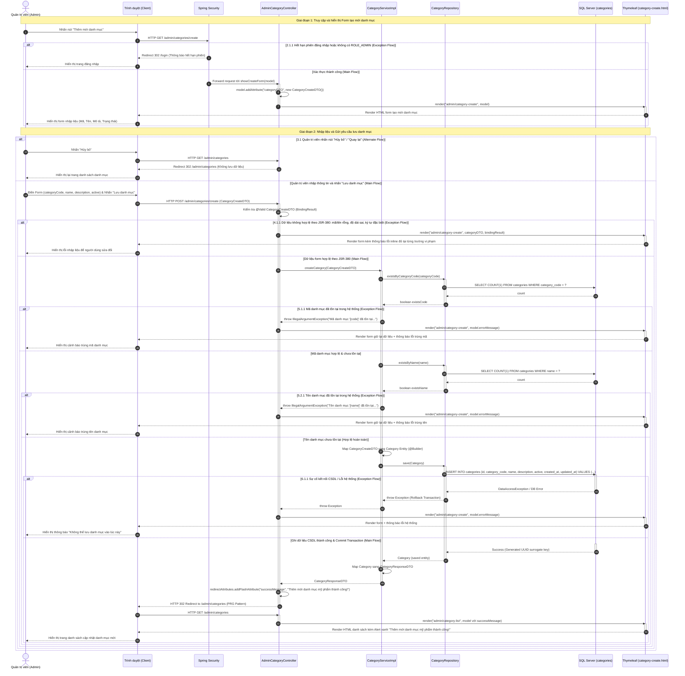
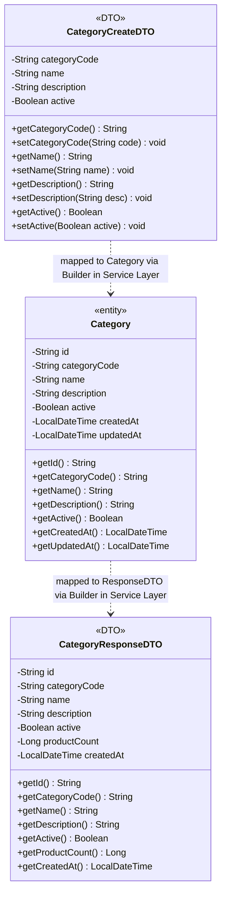

# Mermaid Diagrams: admin-create-category

Tài liệu thiết kế kiến trúc và luồng xử lý chi tiết cho Use Case **Quản trị viên thêm mới danh mục mỹ phẩm** (`uc001a-admin-create-category`).

---

## 1. System Architecture

Biểu diễn luồng phân lớp Server-Side Rendering (SSR) trong quy trình thêm mới danh mục mỹ phẩm từ trình duyệt của Quản trị viên qua bộ lọc Spring Security, Spring MVC Controller, Service Layer, Spring Data JPA Repository tới cơ sở dữ liệu Microsoft SQL Server.

---

## 2. Sequence Diagram

Mô tả chi tiết chu kỳ Request-Response theo chuẩn học thuật chuyên sâu, bao quát toàn bộ Main Flow, Alternate Flow (hủy bỏ) và các Exception Flows (lỗi xác thực JSR-380, trùng mã danh mục, trùng tên danh mục, lỗi cơ sở dữ liệu/transaction rollback).

---

## 3. Class Diagram

Mô hình cấu trúc lớp chi tiết giữa Entity `Category`, `CategoryCreateDTO` và `CategoryResponseDTO` tham gia trong use case `admin-create-category`.

