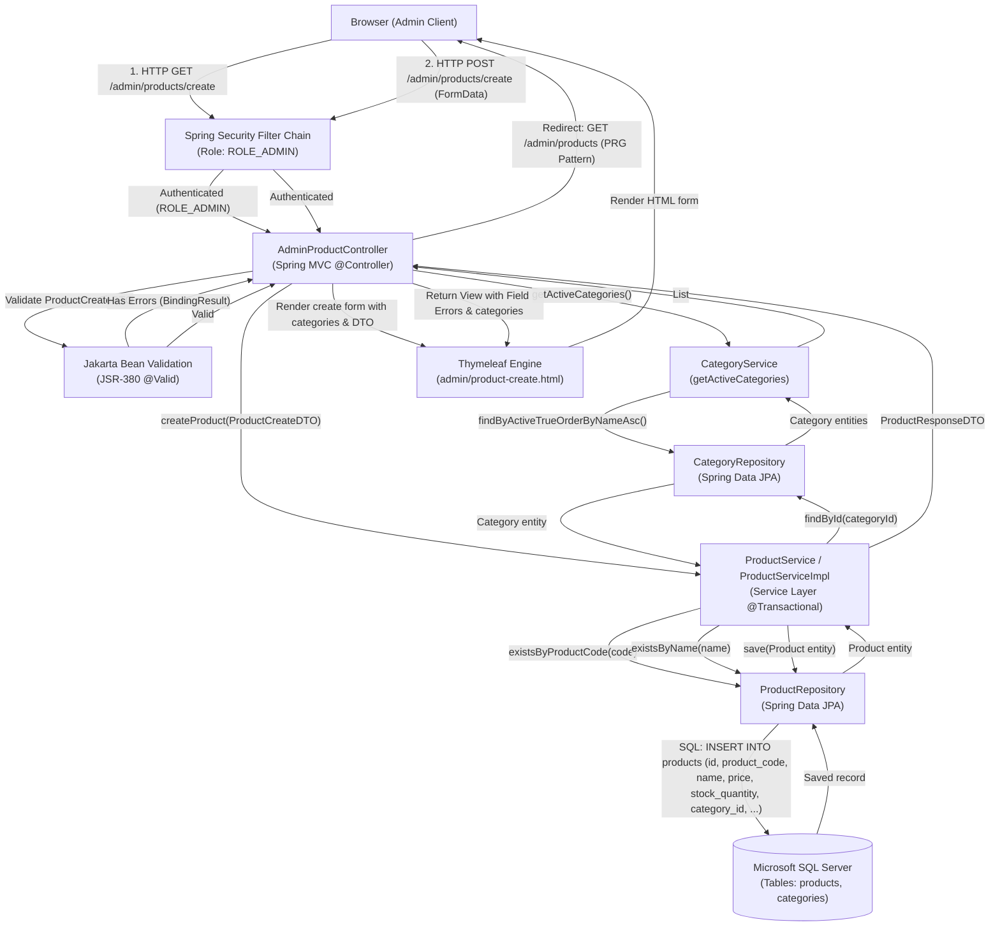
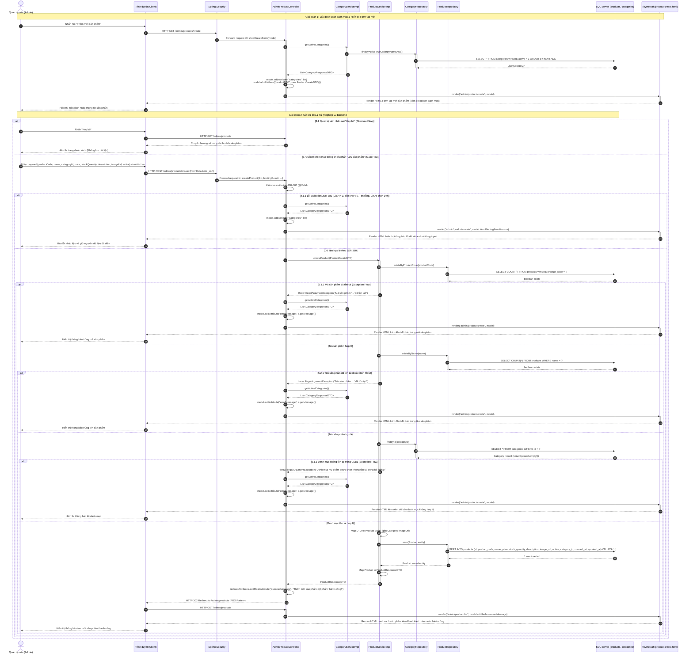
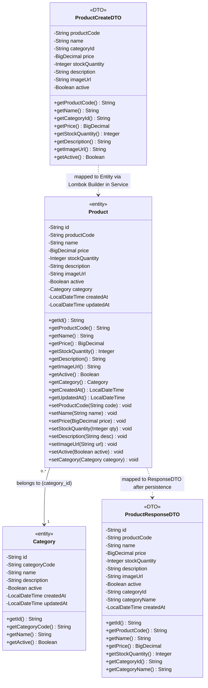

# Mermaid Diagrams: admin-create-product

Tài liệu thiết kế kiến trúc và luồng xử lý chi tiết cho Use Case **Quản trị viên thêm mới sản phẩm mỹ phẩm** (`uc002a-admin-create-product`).

---

## 1. System Architecture

Biểu diễn luồng phân lớp Server-Side Rendering (SSR) trong quy trình tạo mới sản phẩm mỹ phẩm từ trình duyệt của Quản trị viên qua bộ lọc Spring Security, Spring MVC Controller, Bean Validation (JSR-380), Service Layer (kiểm tra nghiệp vụ và quan hệ danh mục), Spring Data JPA Repository tới cơ sở dữ liệu Microsoft SQL Server.

---

## 2. Sequence Diagram

Mô tả chi tiết chu kỳ Request-Response theo chuẩn học thuật chuyên sâu, bao quát toàn bộ quy trình tải danh mục lên form, kiểm tra quyền hạn, Alternate Flow (hủy bỏ) và các Exception Flows (lỗi JSR-380, trùng mã SP, trùng tên SP, danh mục không tồn tại, lỗi CSDL).

---

## 3. Class Diagram

Mô hình cấu trúc lớp thể hiện mối quan hệ giữa thực thể CSDL `Product`, `Category` và các DTO `ProductCreateDTO`, `ProductResponseDTO` trong use case `admin-create-product`.

