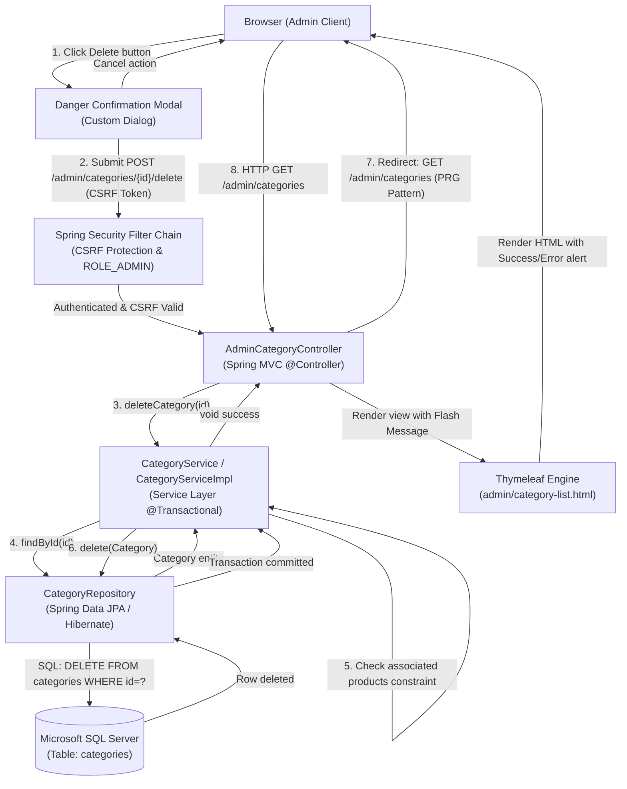
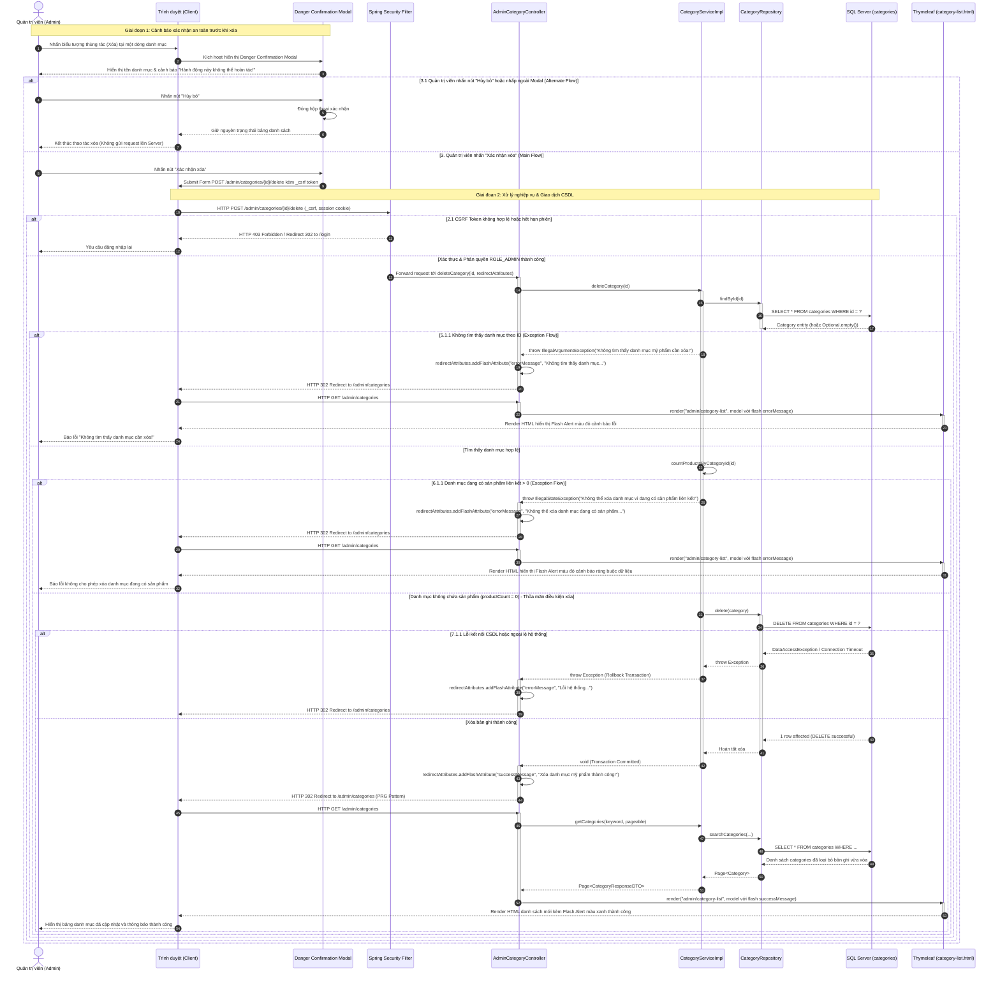
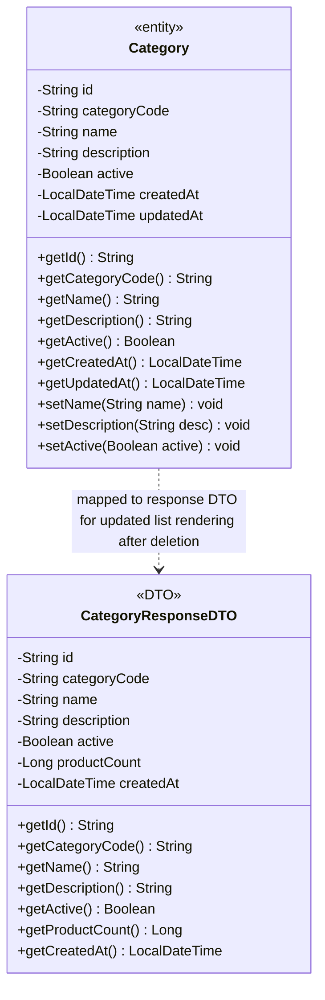

# Mermaid Diagrams: admin-delete-category

Tài liệu thiết kế kiến trúc và luồng xử lý chi tiết cho Use Case **Quản trị viên xóa danh mục mỹ phẩm** (`uc001c-admin-delete-category`).

---

## 1. System Architecture

Biểu diễn luồng phân lớp Server-Side Rendering (SSR) trong quy trình xóa danh mục mỹ phẩm từ trình duyệt của Quản trị viên qua bộ lọc bảo mật Spring Security, Spring MVC Controller, Service Layer (quản lý logic kiểm tra ràng buộc sản phẩm), Spring Data JPA Repository tới cơ sở dữ liệu Microsoft SQL Server.

---

## 2. Sequence Diagram

Mô tả chi tiết chu kỳ Request-Response theo chuẩn học thuật chuyên sâu, bao quát toàn bộ quy trình kích hoạt Modal cảnh báo nguy hiểm, kiểm tra bảo mật CSRF / quyền hạn, Alternate Flow (người dùng hủy thao tác xóa), và các Exception Flows (danh mục không tồn tại, danh mục đang chứa sản phẩm liên kết không được phép xóa, lỗi kết nối CSDL).

---

## 3. Class Diagram

Mô hình cấu trúc lớp thể hiện mối quan hệ giữa thực thể CSDL `Category` và DTO hiển thị danh sách `CategoryResponseDTO` tham gia trong use case `admin-delete-category`.

