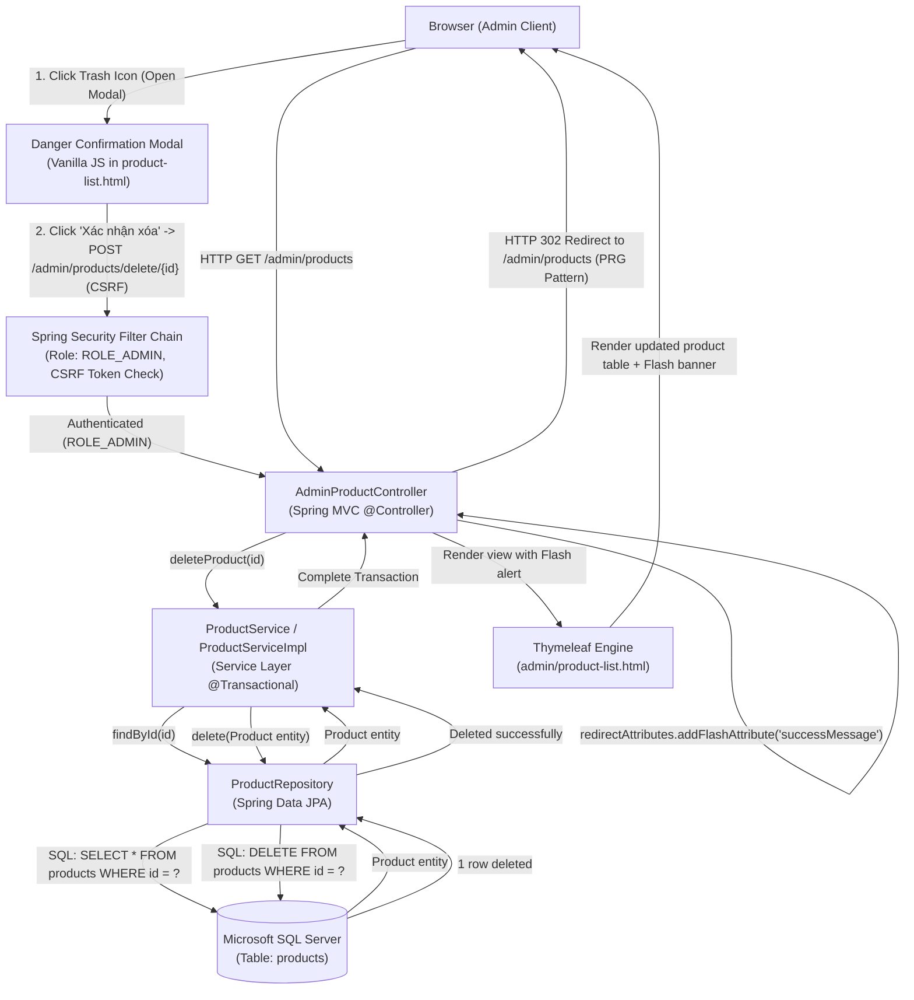
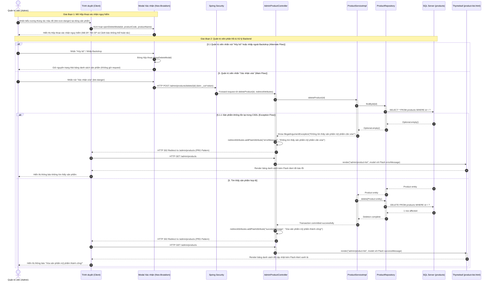
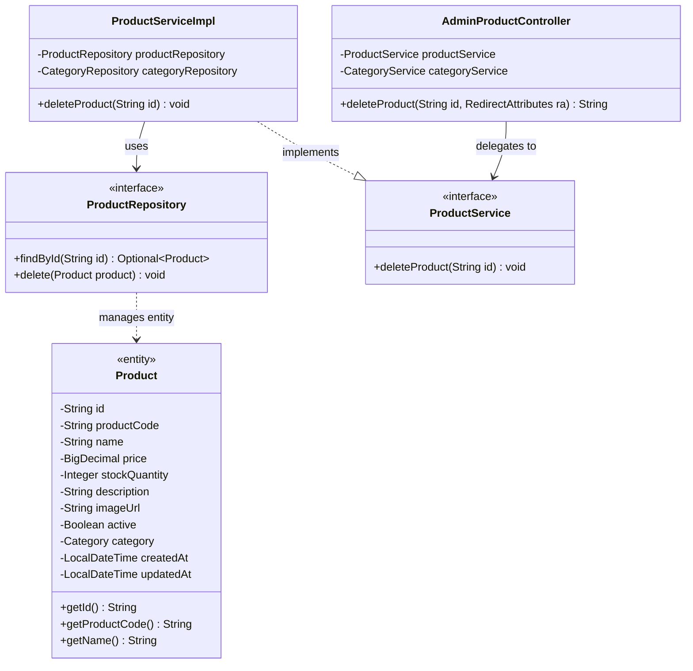

# Mermaid Diagrams: admin-delete-product

Tài liệu thiết kế kiến trúc và luồng xử lý chi tiết cho Use Case **Quản trị viên xóa sản phẩm mỹ phẩm** (`uc002c-admin-delete-product`).

---

## 1. System Architecture

Biểu diễn luồng phân lớp Server-Side Rendering (SSR) trong quy trình xóa sản phẩm từ trình duyệt của Quản trị viên qua Hộp thoại xác nhận nguy hiểm (Danger Confirmation Modal), bộ lọc Spring Security, Spring MVC Controller, Service Layer (quản lý Transaction và kiểm tra sự tồn tại), Spring Data JPA Repository tới cơ sở dữ liệu Microsoft SQL Server.

---

## 2. Sequence Diagram (Comprehensive Academic Flow)

Mô tả chi tiết chu kỳ Request-Response theo chuẩn học thuật chuyên sâu, bao gồm Giai đoạn mở Modal xác nhận trên Client, Giai đoạn hủy bỏ (Alternate Flow), Giai đoạn gửi yêu cầu xóa qua phương thức `POST` có CSRF token, kiểm tra thực thể tại Service và các kịch bản ngoại lệ (Exception Flows).

---

## 3. Class Diagram

Mô hình cấu trúc lớp thể hiện mối quan hệ giữa các thành phần liên quan trong use case `admin-delete-product`.

