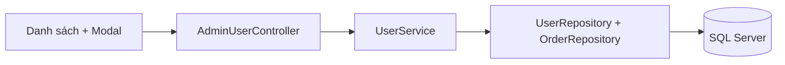
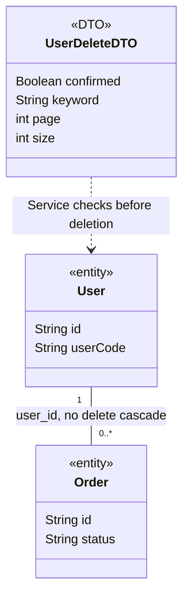

### 1. System Architecture

### 2. Sequence Diagram
```mermaid
sequenceDiagram
 actor Admin
 participant View as Danh sách và Modal
 participant Security
 participant MVC as AdminUserController
 participant Service as UserServiceImpl
 participant Users as UserRepository
 participant Orders as OrderRepository
 participant DB as SQL Server
 Admin->>View: Chọn Xóa ở một User
 View-->>Admin: Modal tên và mã User; focus Hủy
 alt Hủy hoặc Escape
 View-->>Admin: Đóng Modal; không gửi request
 else Xác nhận
 View->>Security: POST /admin/users/id/delete + CSRF
 alt Thiếu CSRF hoặc không có quyền ADMIN
 Security-->>View: 403 hoặc yêu cầu đăng nhập
 else ADMIN hợp lệ
 Security->>MVC: delete(id,dto,principal)
 MVC->>MVC: @Valid UserDeleteDTO
 alt Chưa xác nhận hoặc DTO sai
 MVC-->>View: Redirect danh sách + Flash lỗi
 else Dữ liệu hợp lệ
 MVC->>Service: delete(id,dto,actorId)
 Service->>Users: lockActiveAdmins()
 Users->>DB: Khóa dòng Admin theo thứ tự ID
 Service->>Users: findForUpdate(id)
 alt Không tồn tại / tự xóa / Admin cuối cùng
 Service-->>MVC: Business exception
 MVC-->>View: Redirect + Flash lỗi
 else Được phép kiểm tra đơn
 Service->>Orders: existsByUserId(id)
 Orders->>DB: Kiểm tra mọi trạng thái đơn
 alt Có đơn
 Service-->>MVC: IllegalArgumentException
 MVC-->>View: Redirect + Flash cấm xóa
 else Không có đơn
 Service->>Users: delete(user); flush()
 Users->>DB: DELETE User, FK vẫn bảo vệ
 alt FK thay đổi đồng thời hoặc khóa thất bại
 Service-->>MVC: DataAccessException; rollback
 MVC-->>View: Redirect + Flash lỗi
 else Commit thành công
 MVC-->>View: Redirect giữ bộ lọc + Flash thành công
 end
 end
 end
 end
 end
 end
```
### 3. Class Diagram

