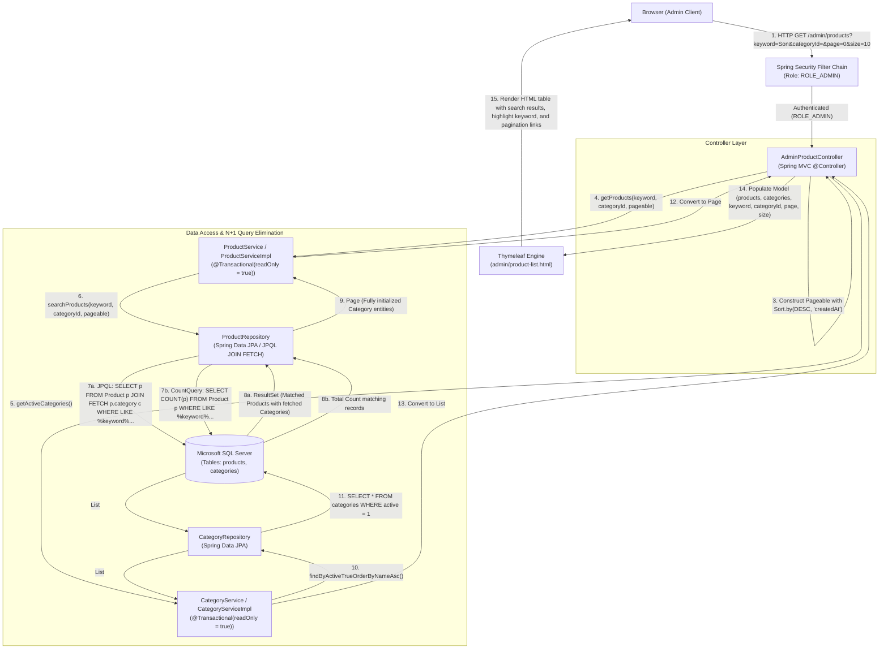
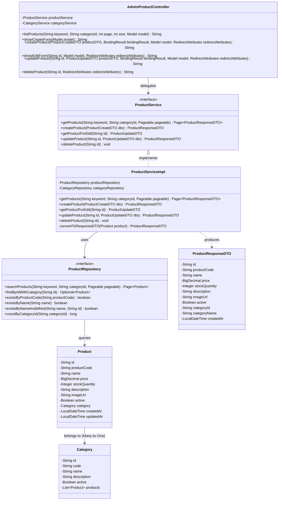

# Mermaid Diagrams: admin-search-products

Tài liệu thiết kế kiến trúc và sơ đồ luồng xử lý chi tiết cho Use Case **Quản trị viên tìm kiếm sản phẩm mỹ phẩm theo tên hoặc mã SP** (`uc002e-admin-search-products`).

---

## 1. System Architecture

Biểu diễn luồng phân lớp Server-Side Rendering (SSR) khi Admin thực hiện tìm kiếm sản phẩm mỹ phẩm qua thanh công cụ tìm kiếm trên trang danh sách sản phẩm. Kiến trúc đảm bảo truy vấn tối ưu qua cơ chế **JPQL JOIN FETCH kết hợp LIKE không phân biệt chữ hoa/thường** để triệt tiêu hoàn toàn vấn đề N+1 Query.



---

## 2. Sequence Diagram (Academic Detailed Flow)

Mô tả chi tiết chu kỳ Request-Response theo chuẩn học thuật chuyên sâu:
1. Tiếp nhận tham số `keyword` từ thanh tìm kiếm.
2. Xử lý logic tại Service và câu lệnh truy vấn JPQL `JOIN FETCH` trong Repository.
3. Cơ chế bảo toàn tham số tìm kiếm trên các nút liên kết phân trang.
4. Xử lý kịch bản kết quả tìm kiếm rỗng (Empty State).

```mermaid
sequenceDiagram
    autonumber
    actor Admin as Quản trị viên (Admin)
    participant Browser as Trình duyệt (Browser)
    participant Controller as AdminProductController
    participant ProdService as ProductServiceImpl
    participant ProdRepo as ProductRepository
    participant CatService as CategoryServiceImpl
    participant CatRepo as CategoryRepository
    participant DB as Microsoft SQL Server
    participant Thymeleaf as Thymeleaf Engine

    Admin->>Browser: Nhập từ khóa 'Son dưỡng' vào ô tìm kiếm & nhấn Enter / Lọc
    Browser->>Controller: GET /admin/products?keyword=Son+d%C6%B0%E1%BB%A1ng&categoryId=&page=0&size=10
    
    activate Controller
    Note over Controller: Chuẩn hóa tham số:<br/>- pageIndex = Math.max(0, page)<br/>- pageSize = 10, 20 hoặc 50<br/>- keyword = keyword.trim()
    
    Controller->>ProdService: getProducts("Son dưỡng", null, PageRequest.of(0, 10, Sort.DESC))
    activate ProdService
    
    ProdService->>ProdRepo: searchProducts("Son dưỡng", null, pageable)
    activate ProdRepo
    
    ProdRepo->>DB: 1. SELECT p.*, c.* FROM products p INNER JOIN categories c ON p.category_id = c.id<br/>WHERE (LOWER(p.name) LIKE '%son dưỡng%' OR LOWER(p.product_code) LIKE '%son dưỡng%')<br/>ORDER BY p.created_at DESC OFFSET 0 ROWS FETCH NEXT 10 ROWS ONLY
    ProdRepo->>DB: 2. SELECT COUNT(p.id) FROM products p WHERE (LOWER(p.name) LIKE '%son dưỡng%' OR LOWER(p.product_code) LIKE '%son dưỡng%')
    
    DB-->>ProdRepo: Trả về Danh sách 10 sản phẩm (kèm dữ liệu Category) & Tổng số bản ghi (Total Elements)
    deactivate DB
    
    ProdRepo-->>ProdService: Page<Product> (Chứa đầy đủ Category, KHÔNG phát sinh query phụ)
    deactivate ProdRepo
    
    Note over ProdService: Chuyển đổi Entity sang Page<ProductResponseDTO>
    ProdService-->>Controller: Page<ProductResponseDTO>
    deactivate ProdService
    
    Controller->>CatService: getActiveCategories()
    activate CatService
    CatService->>CatRepo: findByActiveTrueOrderByNameAsc()
    activate CatRepo
    CatRepo->>DB: SELECT * FROM categories WHERE active = 1 ORDER BY name ASC
    DB-->>CatRepo: List<Category>
    CatRepo-->>CatService: List<Category>
    deactivate CatRepo
    CatService-->>Controller: List<CategoryResponseDTO>
    deactivate CatService

    Note over Controller: Đưa dữ liệu vào Model:<br/>- 'products': Page<ProductResponseDTO><br/>- 'categories': List<CategoryResponseDTO><br/>- 'keyword': 'Son dưỡng'<br/>- 'currentPage': 0, 'pageSize': 10

    Controller->>Thymeleaf: Render "admin/product-list" (Model attributes)
    activate Thymeleaf
    
    alt Có sản phẩm phù hợp
        Thymeleaf-->>Browser: Trả về HTML chứa bảng danh sách sản phẩm tìm thấy,<br/>giữ nguyên từ khóa trong ô input & bảo toàn keyword trong URL phân trang
    else Không tìm thấy sản phẩm nào
        Thymeleaf-->>Browser: Trả về HTML hiển thị Empty State "Không tìm thấy sản phẩm nào phù hợp với từ khóa"<br/>kèm nút "Xóa bộ lọc"
    end
    deactivate Thymeleaf
    deactivate Controller

    Browser-->>Admin: Hiển thị kết quả tìm kiếm trực quan trên giao diện
```

---

## 3. Class Diagram (Data Structure & Component Architecture)

Mô tả cấu trúc lớp, phương thức tìm kiếm và mối quan hệ giữa các thành phần trong phân hệ.


