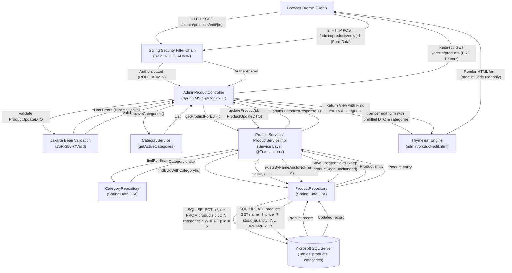
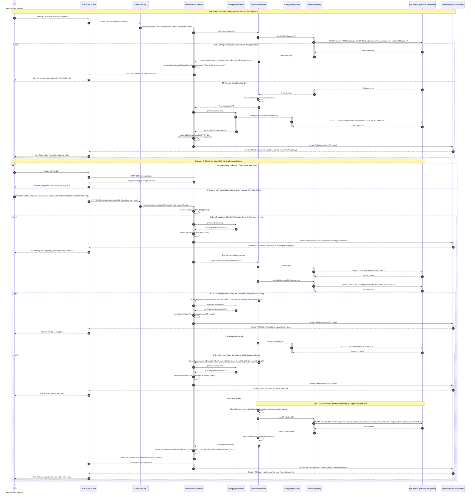
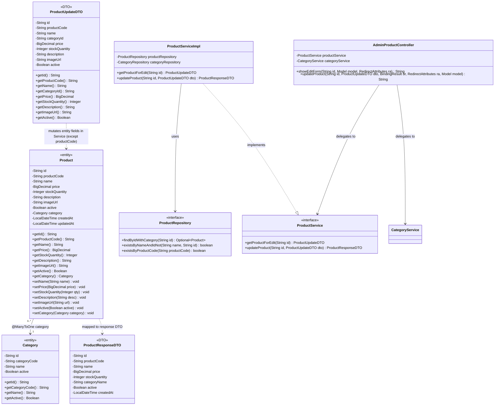

# Mermaid Diagrams: admin-update-product

Tài liệu thiết kế kiến trúc và luồng xử lý chi tiết cho Use Case **Quản trị viên cập nhật thông tin sản phẩm mỹ phẩm** (`uc002b-admin-update-product`).

---

## 1. System Architecture

Biểu diễn luồng phân lớp Server-Side Rendering (SSR) trong quy trình tải form chỉnh sửa và cập nhật dữ liệu sản phẩm từ trình duyệt Quản trị viên qua bộ lọc Spring Security, Spring MVC Controller, Bean Validation (JSR-380), Service Layer (kiểm tra nghiệp vụ, trùng tên có loại trừ ID và quan hệ danh mục), Spring Data JPA Repository tới cơ sở dữ liệu Microsoft SQL Server.

---

## 2. Sequence Diagram (Comprehensive Academic Flow)

Mô tả chi tiết chu kỳ Request-Response theo chuẩn học thuật chuyên sâu, bao gồm Giai đoạn tải dữ liệu form, kiểm tra mã sản phẩm bất biến, quy tắc kiểm tra trùng tên loại trừ chính mình (`existsByNameAndIdNot`), kiểm tra danh mục trong CSDL và các kịch bản ngoại lệ.

---

## 3. Class Diagram

Mô hình cấu trúc lớp thể hiện mối quan hệ giữa thực thể CSDL `Product`, `Category`, DTO `ProductUpdateDTO`, `ProductResponseDTO` và các tầng xử lý trong use case `admin-update-product`.

