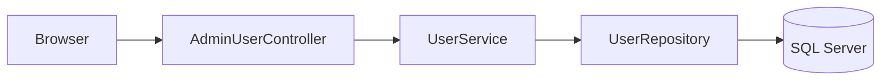
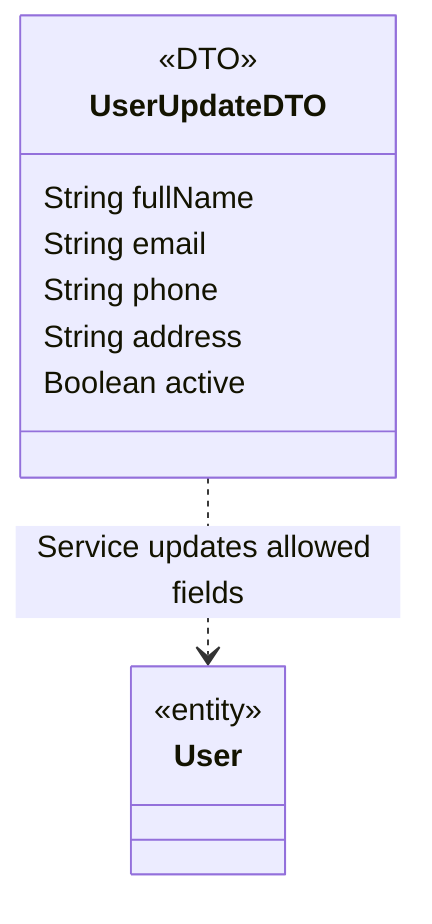

### 1. System Architecture

### 2. Sequence Diagram
```mermaid
sequenceDiagram
 actor Admin
 participant MVC as AdminUserController
 participant Service as UserServiceImpl
 participant Repo as UserRepository
 participant DB as SQL Server
 Admin->>MVC: POST /admin/users/id/edit + CSRF
 MVC->>MVC: @Valid UserUpdateDTO; principal ID
 alt Dữ liệu sai
 MVC-->>Admin: Form với lỗi cạnh trường
 else Hợp lệ
 MVC->>Service: update(id,dto,actorId)
 Service->>Repo: lockActiveAdmins()
 Repo->>DB: Pessimistic write theo thứ tự ID
 Service->>Repo: findForUpdate(id)
 alt Không tồn tại
 Service-->>MVC: UserNotFoundException
 MVC-->>Admin: Redirect danh sách + Flash lỗi
 else User tồn tại
 Service->>Service: guardDeactivation(user,actorId,adminCount)
 Service->>Repo: existsByEmailIgnoreCaseAndIdNot(email,id)
 alt Tự khóa / Admin cuối cùng / email trùng
 Service-->>MVC: IllegalArgumentException
 MVC-->>Admin: Form với lỗi nghiệp vụ
 else Được phép
 Service->>Repo: saveAndFlush(user)
 Repo->>DB: UPDATE hồ sơ/trạng thái; giữ role/password
 Service-->>MVC: Commit
 MVC-->>Admin: Redirect danh sách + Flash thành công
 end
 end
 end
```
### 3. Class Diagram

