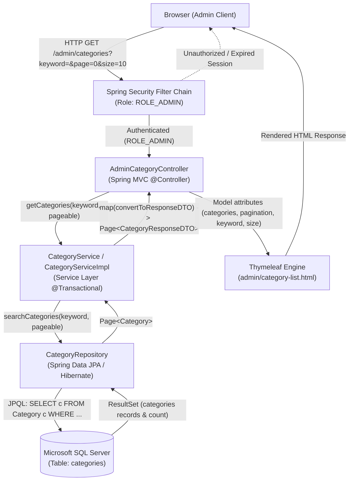
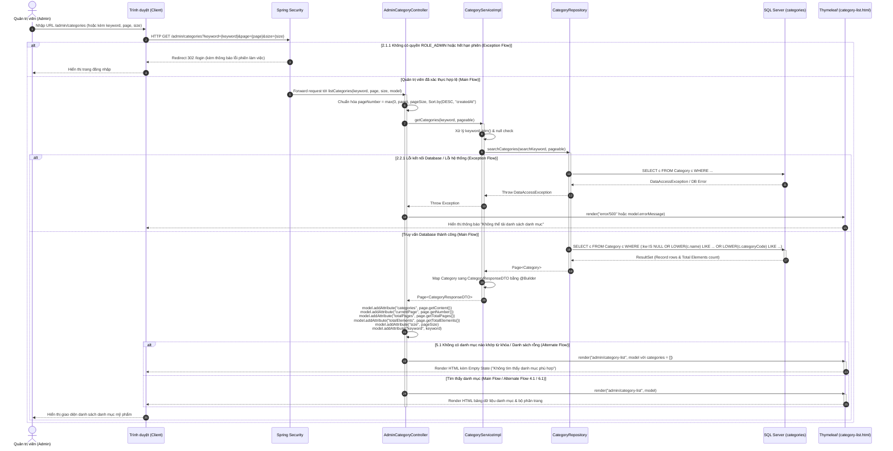
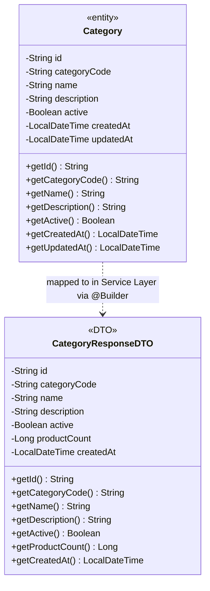

# Mermaid Diagrams: admin-view-categories

Tài liệu thiết kế kiến trúc và luồng xử lý chi tiết cho Use Case **Quản trị viên xem danh sách các danh mục mỹ phẩm** (`uc001d-admin-view-categories`).

---

## 1. System Architecture

Biểu diễn luồng phân lớp Server-Side Rendering (SSR) từ trình duyệt người dùng qua tầng bảo mật Spring Security, Spring MVC Controller, Service Layer, Spring Data JPA Repository đến cơ sở dữ liệu Microsoft SQL Server.

---

## 2. Sequence Diagram

Mô tả chi tiết chu kỳ Request-Response với chuẩn học thuật cao, bao gồm Main Flow, Alternate Flows (xóa bộ lọc, rỗng kết quả, đổi kích thước trang) và Exception Flows (hết hạn phiên đăng nhập, lỗi hệ thống cơ sở dữ liệu).

---

## 3. Class Diagram

Mô hình cấu trúc lớp chi tiết giữa Entity và DTO tham gia trong use case `admin-view-categories`.

