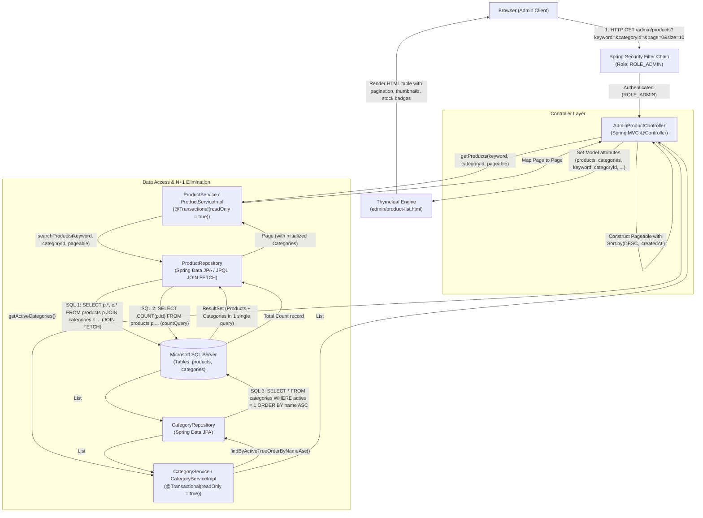
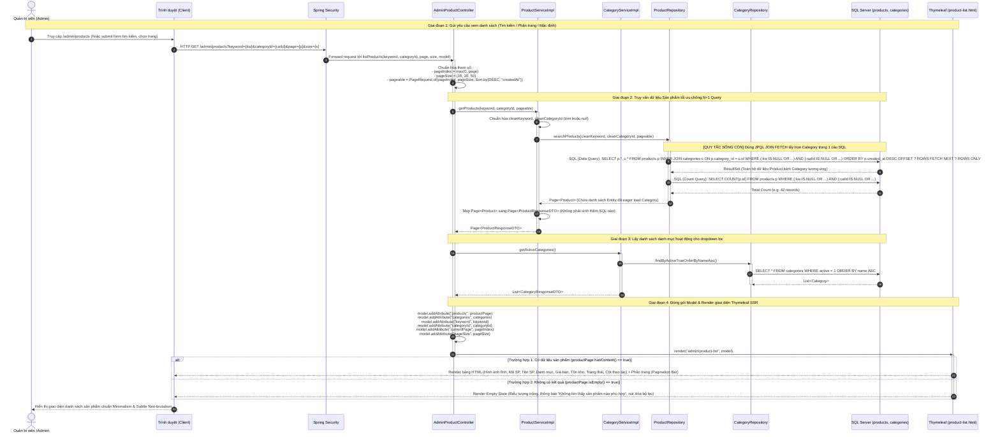
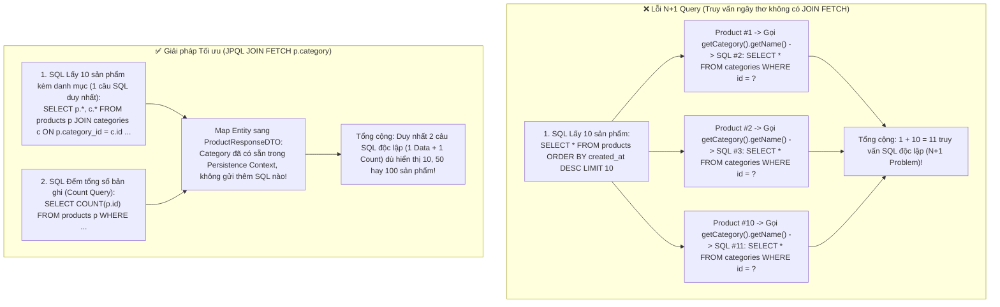
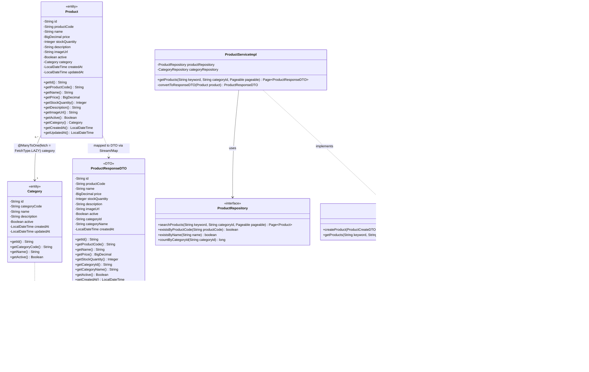

# Mermaid Diagrams: admin-view-products

Tài liệu thiết kế kiến trúc và luồng xử lý chi tiết cho Use Case **Quản trị viên xem danh sách sản phẩm mỹ phẩm có phân trang, lọc và tìm kiếm** (`uc002d-admin-view-products`).

---

## 1. System Architecture

Biểu diễn luồng phân lớp Server-Side Rendering (SSR) trong quy trình tải danh sách sản phẩm từ trình duyệt của Quản trị viên qua bộ lọc Spring Security, Spring MVC Controller, Service Layer (phân trang, sắp xếp và chuyển đổi DTO), Spring Data JPA Repository với cơ chế **JPQL JOIN FETCH** triệt tiêu N+1 Query tới cơ sở dữ liệu Microsoft SQL Server, kết xuất qua Thymeleaf Engine.

---

## 2. Sequence Diagram (Academic Detailed Flow)

Mô tả chi tiết chu kỳ Request-Response theo chuẩn học thuật chuyên sâu, thể hiện rõ cách thức truy vấn CSDL bằng `JOIN FETCH` để loại trừ hoàn toàn hiện tượng N+1 Query, các kịch bản tìm kiếm, phân trang và hiển thị trạng thái rỗng (Empty State).

---

## 3. N+1 Query Elimination Breakdown (So sánh Cơ chế)

Sơ đồ đối sánh sự khác biệt then chốt giữa truy vấn thông thường gây lỗi N+1 Query và truy vấn tối ưu học thuật bằng `JOIN FETCH`:

---

## 4. Class Diagram

Mô hình cấu trúc lớp thể hiện mối quan hệ giữa thực thể CSDL `Product`, `Category`, `ProductResponseDTO`, tầng Repository và Controller trong use case `admin-view-products`.

