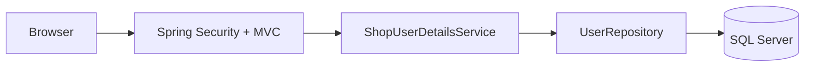
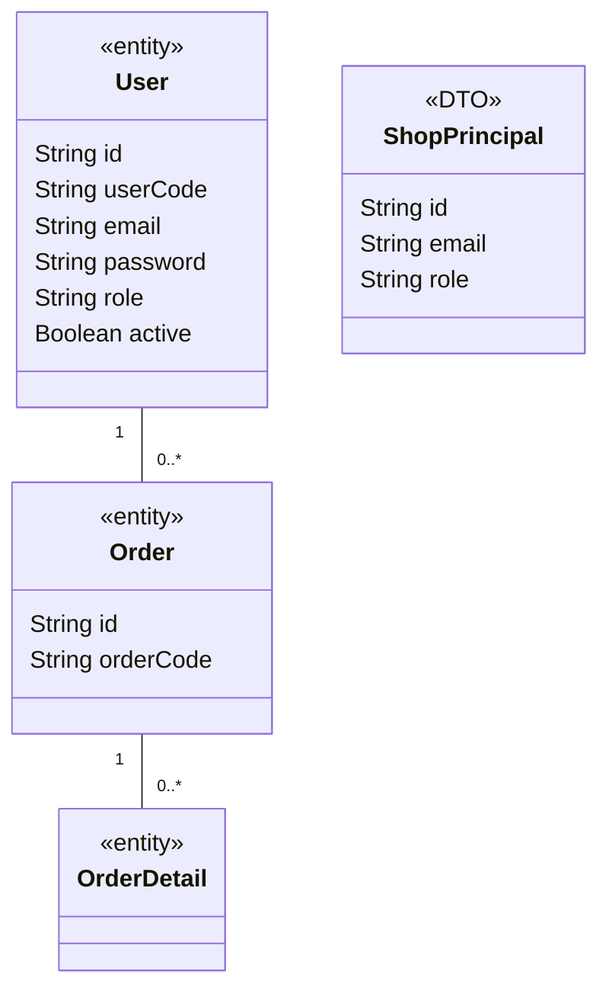

### 1. System Architecture


### 2. Sequence Diagram
```mermaid
sequenceDiagram
 actor Guest
 participant View as Thymeleaf
 participant Security as Spring Security
 participant Service as ShopUserDetailsService
 participant Repo as UserRepository
 participant DB as SQL Server
 Guest->>View: Nhập email và mật khẩu
 View->>Security: POST /login + CSRF
 alt CSRF không hợp lệ
 Security-->>View: 403
 else CSRF hợp lệ
 Security->>Service: loadUserByUsername(email)
 Service->>Repo: findByEmailIgnoreCase(email)
 Repo->>DB: Tìm User
 DB-->>Repo: User hoặc rỗng
 Repo-->>Service: Optional User
 Service-->>Security: ShopPrincipal hoặc UsernameNotFoundException
 alt Mật khẩu sai hoặc tài khoản bị khóa/không tồn tại
 Security-->>View: redirect /login?error
 else Hợp lệ
 Security-->>View: redirect /admin/users hoặc /
 end
 end
 loop Mỗi request đã đăng nhập
 Security->>Service: isCurrent(principal)
 Service->>Repo: findById(id)
 alt User bị khóa/xóa hoặc thông tin xác thực đã đổi
 Security-->>View: Hủy session; redirect /login?expired
 else User còn hoạt động
 Security-->>View: Kiểm tra quyền và xử lý request
 end
 end
```

### 3. Class Diagram

