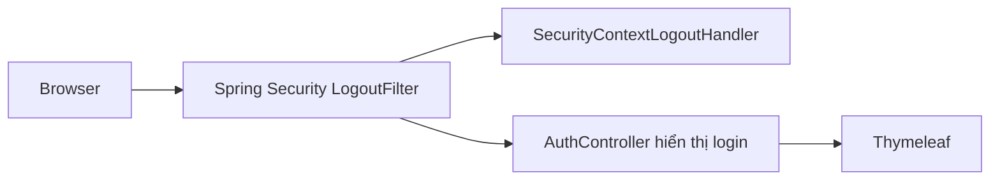
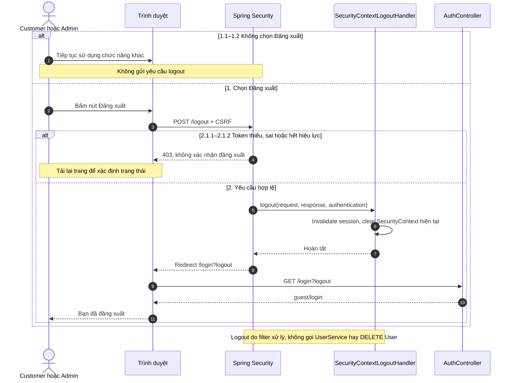
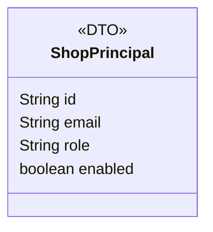

### 1. System Architecture

### 2. Sequence Diagram

### 3. Class Diagram

Đăng xuất xóa thông tin xác thực của lần đăng nhập hiện tại. Không cập nhật entity, không có LogoutDTO hoặc lời gọi Repository riêng.
