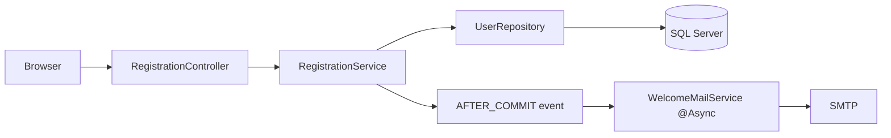
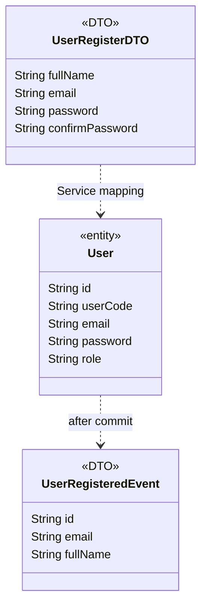

### 1. System Architecture


### 2. Sequence Diagram
```mermaid
sequenceDiagram
 actor Guest
 participant MVC as RegistrationController
 participant Service as RegistrationServiceImpl
 participant Repo as UserRepository
 participant DB as SQL Server
 participant Listener as WelcomeMailListener
 participant Mail as WelcomeMailService
 participant SMTP
 Guest->>MVC: POST /register + CSRF
 MVC->>MVC: @Valid UserRegisterDTO
 alt Invalid DTO
 MVC-->>Guest: Form với lỗi, không điền lại mật khẩu
 else Valid DTO
 MVC->>Service: register(dto)
 Service->>Repo: existsByEmailIgnoreCase(email)
 alt Email đã có
 Service-->>MVC: IllegalArgumentException
 MVC-->>Guest: Lỗi email
 else Email mới
 Service->>Service: BCrypt; ROLE_CUSTOMER; mã User UUID
 Service->>Repo: saveAndFlush(user)
 Repo->>DB: INSERT User
 alt Unique conflict hoặc rollback
 Service-->>MVC: Exception
 MVC-->>Guest: Lỗi, không gửi email
 else Commit
 Service->>Listener: registered(UserRegisteredEvent)
 Listener->>Mail: send(event) qua executor riêng
 MVC-->>Guest: redirect /login + Flash
 Mail->>SMTP: send(message)
 alt SMTP lỗi hoặc hàng đợi đầy
 Mail->>Mail: Ghi nhận lỗi, tài khoản giữ nguyên
 else Gửi thành công
 Mail->>Mail: Ghi nhận gửi thành công
 end
 end
 end
 end
```

### 3. Class Diagram

