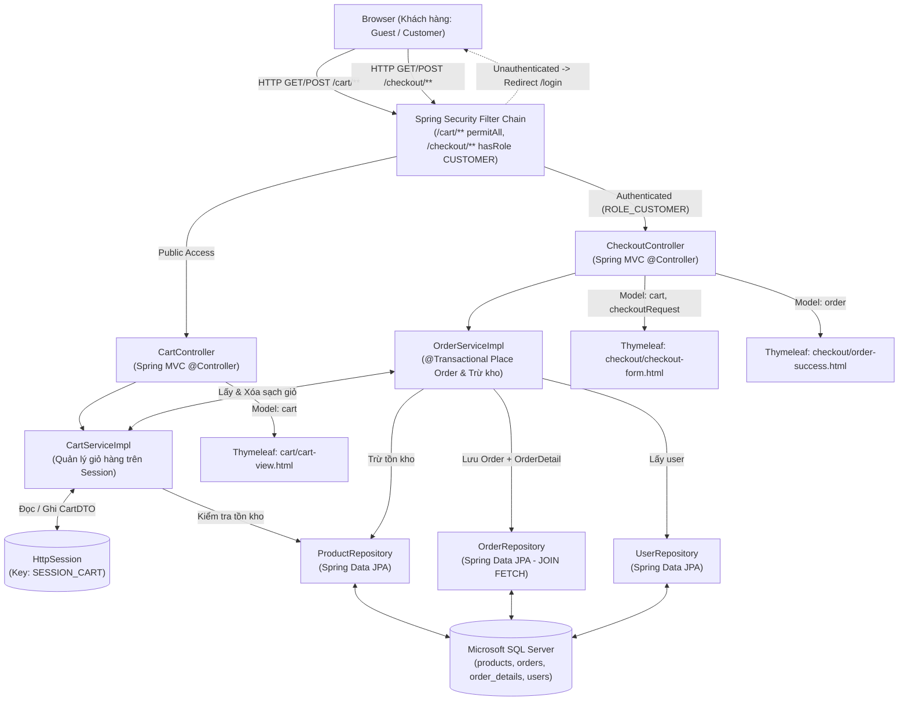
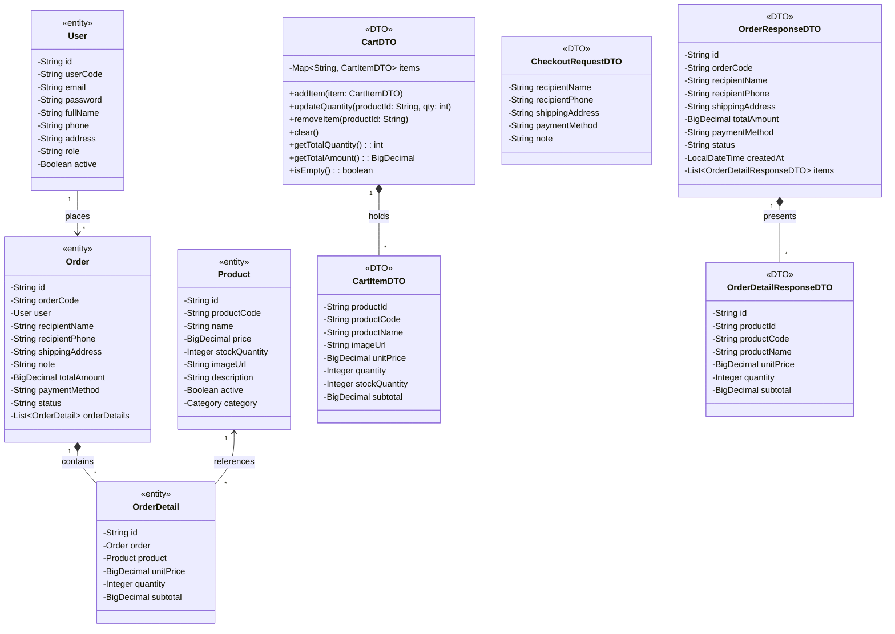

# Mermaid Diagrams: cart-checkout

Tài liệu thiết kế kiến trúc và sơ đồ tương tác chi tiết cho Module **Giỏ hàng & Thanh toán (Cart & Checkout)** (`uc002-shopping-cart` và `uc003-checkout`).

---

## 1. System Architecture

Biểu diễn luồng phân lớp Server-Side Rendering (SSR) từ trình duyệt người dùng qua tầng bảo mật Spring Security, Spring MVC Controller, Service Layer, Session Storage (`HttpSession`), Spring Data JPA Repository đến cơ sở dữ liệu Microsoft SQL Server.



---

## 2. Sequence Diagram (Academic Standard)

Mô tả chi tiết chu kỳ Request-Response cho nghiệp vụ **Đặt hàng & Thanh toán (Checkout)** bao gồm kiểm tra bảo mật, validate dữ liệu JSR-380, kiểm tra tồn kho, trừ tồn kho, quản lý transaction, và làm sạch giỏ hàng trong Session.

```mermaid
sequenceDiagram
    autonumber
    actor Customer as Khách hàng (Customer)
    participant Browser as Trình duyệt (Client)
    participant Security as Spring Security
    participant Controller as CheckoutController
    participant OrderSvc as OrderServiceImpl
    participant CartSvc as CartServiceImpl
    participant Session as HttpSession
    participant ProductRepo as ProductRepository
    participant OrderRepo as OrderRepository
    participant DB as SQL Server
    participant View as Thymeleaf (order-success)

    Customer->>Browser: Nhấn nút "Xác nhận đặt hàng" trên Form Checkout
    Browser->>Security: HTTP POST /checkout (Payload: recipientName, phone, address, paymentMethod)
    
    alt Chưa đăng nhập (Exception Flow 2.1)
        Security-->>Browser: Redirect 302 /login (SavedRequest: /checkout)
        Browser-->>Customer: Chuyển hướng tới trang Đăng nhập
    else Đã đăng nhập ROLE_CUSTOMER (Main Flow)
        Security->>Controller: processCheckout(checkoutRequest, bindingResult, principal, session)
        activate Controller

        Controller->>CartSvc: getCart(session)
        CartSvc->>Session: getAttribute("SESSION_CART")
        Session-->>CartSvc: return CartDTO
        CartSvc-->>Controller: return CartDTO

        alt Giỏ hàng rỗng (Exception Flow 2.2)
            Controller-->>Browser: Redirect 302 /cart (Flash: "Giỏ hàng rỗng!")
            Browser-->>Customer: Hiển thị lại giỏ hàng kèm cảnh báo
        else Giỏ hàng có sản phẩm
            Controller->>Controller: Validate CheckoutRequestDTO (JSR-380 @Valid)
            
            alt Vi phạm quy tắc Validate Form (Exception Flow 5.1)
                Controller-->>Browser: Trả về view "checkout/checkout-form" (kèm lỗi BindingResult)
                Browser-->>Customer: Hiển thị lỗi đỏ dưới input field
            else Dữ liệu Form hợp lệ
                Controller->>OrderSvc: placeOrder(session, userEmail, checkoutRequest)
                activate OrderSvc

                loop Kiểm tra tồn kho từng sản phẩm trong giỏ
                    OrderSvc->>ProductRepo: findByIdAndActiveTrue(productId)
                    ProductRepo->>DB: SELECT p FROM Product p WHERE id = ?
                    DB-->>ProductRepo: return Product
                    ProductRepo-->>OrderSvc: return Product
                    
                    opt Số lượng mua > Tồn kho (Exception Flow 6.1)
                        OrderSvc-->>Controller: throw IllegalArgumentException("Tồn kho không đủ")
                        Controller-->>Browser: Trả về view "checkout/checkout-form" (Flash error)
                        Browser-->>Customer: Hiển thị thông báo sản phẩm hết hàng
                    end
                end

                OrderSvc->>OrderSvc: Trừ stockQuantity và save(Product)
                OrderSvc->>ProductRepo: save(product)
                ProductRepo->>DB: UPDATE products SET stock_quantity = ? WHERE id = ?
                
                OrderSvc->>OrderSvc: generateUniqueOrderCode() -> "DH26001234"
                OrderSvc->>OrderSvc: Build Entity Order + OrderDetail
                OrderSvc->>OrderRepo: save(order)
                OrderRepo->>DB: INSERT INTO orders ...; INSERT INTO order_details ...
                DB-->>OrderRepo: return Saved Order

                OrderSvc->>CartSvc: clearCart(session)
                CartSvc->>Session: remove/clear cart
                
                OrderSvc->>OrderSvc: Map Saved Order sang OrderResponseDTO
                OrderSvc-->>Controller: return OrderResponseDTO
                deactivate OrderSvc

                Controller-->>Browser: Redirect 302 /checkout/success (Flash: orderCode, order)
                Browser->>Controller: HTTP GET /checkout/success
                Controller->>View: Render "checkout/order-success"
                View-->>Browser: HTML kết quả đơn hàng
                Browser-->>Customer: Hiển thị mã đơn hàng, số tiền, cảm ơn quý khách!
            end
        end
        deactivate Controller
    end
```

---

## 3. Class Diagram

Biểu diễn cấu trúc phân lớp giữa các Thực thể CSDL (`<<entity>>`) và các Đối tượng Chuyển giao Dữ liệu (`<<DTO>>`).


