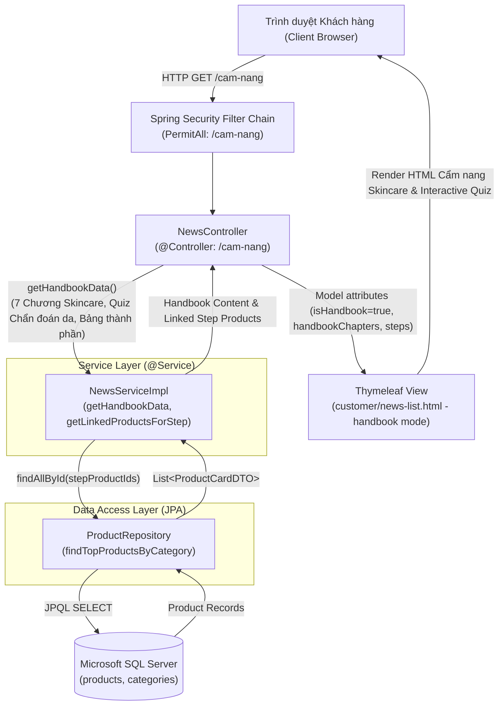
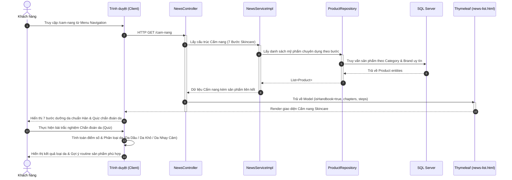
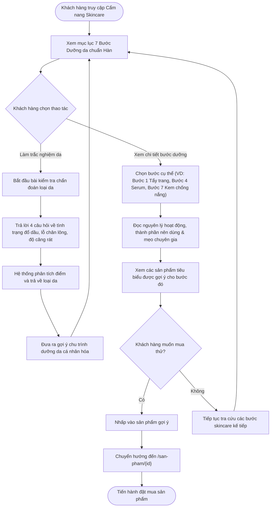

# Mermaid Diagrams: customer-view-handbook

Tài liệu thiết kế kiến trúc và sơ đồ nghiệp vụ cho Use Case **Khách hàng tra cứu Cẩm nang Skincare 7 Bước Chuẩn Hàn & Test Chẩn đoán loại da** (`uc006d-customer-view-handbook`).

---

## 1. System Architecture

Biểu diễn luồng tương tác giữa Cẩm nang làm đẹp (Handbook Module), hệ thống gợi ý sản phẩm phù hợp cho từng bước Skincare và bài kiểm tra chẩn đoán loại da cá nhân hóa.

---

## 2. Sequence Diagram: Tra cứu Cẩm nang & Chẩn đoán loại da

---

## 3. Activity Diagram: Quy trình tra cứu Cẩm nang 7 Bước Skincare

