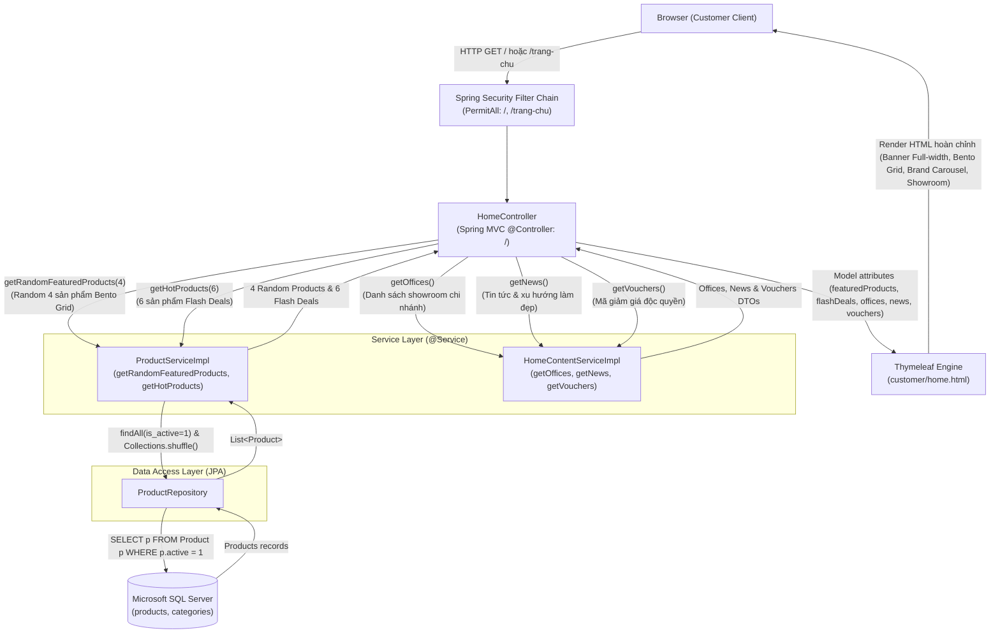
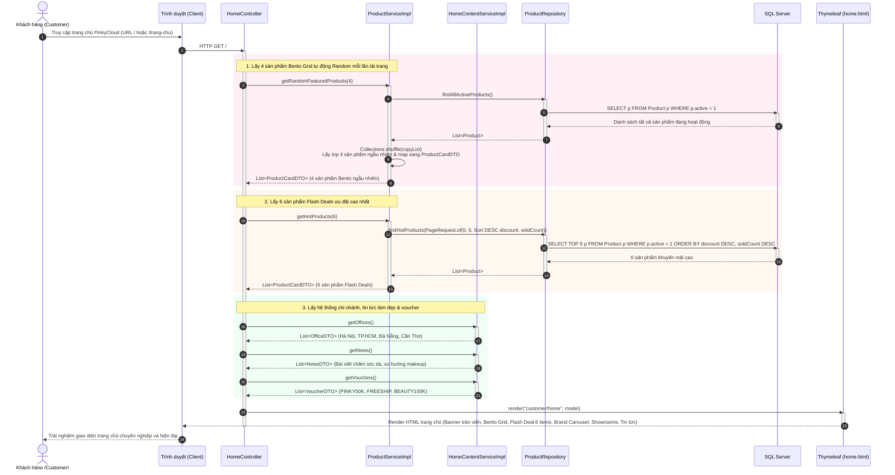
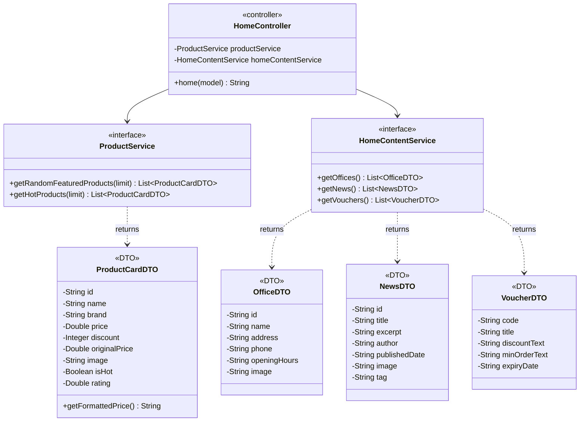

# Mermaid Diagrams: customer-view-home

Tài liệu thiết kế kiến trúc và luồng xử lý chi tiết cho Use Case **Khách hàng trải nghiệm trang chủ PinkyCloud** (`uc004d-customer-view-home`).

---

## 1. System Architecture

Biểu diễn luồng phân lớp Server-Side Rendering (SSR) từ trình duyệt người dùng qua tầng bảo mật Spring Security, `HomeController`, các Services nghiệp vụ (`ProductService`, `HomeContentService`), Repositories đến cơ sở dữ liệu Microsoft SQL Server.

---

## 2. Sequence Diagram

Mô tả chu kỳ Request-Response khi người dùng truy cập trang chủ, quy trình random Bento Grid tự động mỗi lần tải trang, tải flash deals, showroom và bài viết nổi bật.

---

## 3. Class Diagram

Mô hình cấu trúc lớp chi tiết giữa Controller, Services, Repositories và DTOs phục vụ trang chủ `customer-view-home`.

