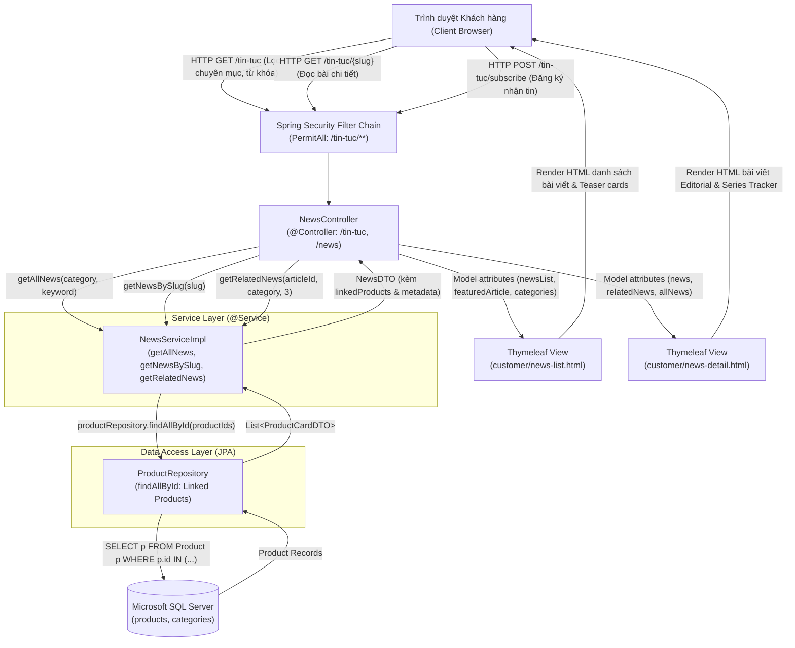
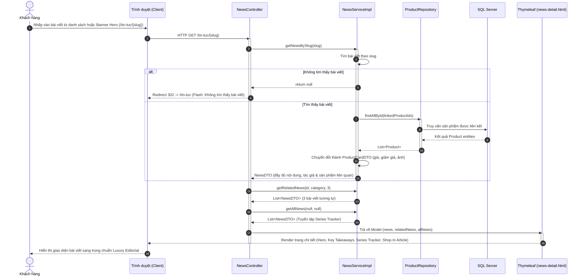
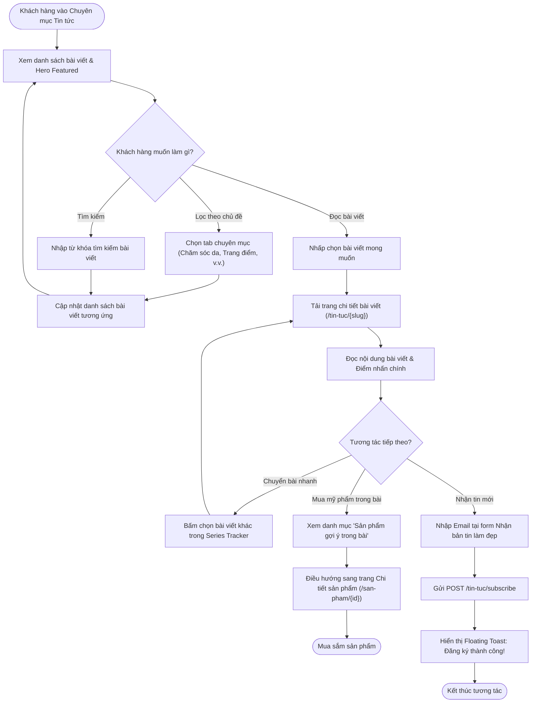

# Mermaid Diagrams: customer-view-news

Tài liệu thiết kế kiến trúc và sơ đồ nghiệp vụ cho Use Case **Khách hàng khám phá Tạp chí làm đẹp & Tin tức xu hướng** (`uc005d-customer-view-news`).

---

## 1. System Architecture

Biểu diễn luồng Server-Side Rendering (SSR) và AJAX API từ trình duyệt khách hàng qua Spring Security Filter, `NewsController`, tầng `NewsService`, kết hợp dữ liệu sản phẩm đính kèm từ `ProductRepository` đến tầng giao diện Thymeleaf.

---

## 2. Sequence Diagram: Xem chi tiết bài viết & Sản phẩm liên kết

Mô tả chu kỳ tương tác khi người dùng chọn đọc một bài viết, hệ thống truy xuất nội dung, ánh xạ sản phẩm chính hãng liên quan để hỗ trợ mua hàng trực tiếp từ nội dung bài viết.

---

## 3. Activity Diagram: Luồng nghiệp vụ Tạp chí làm đẹp

