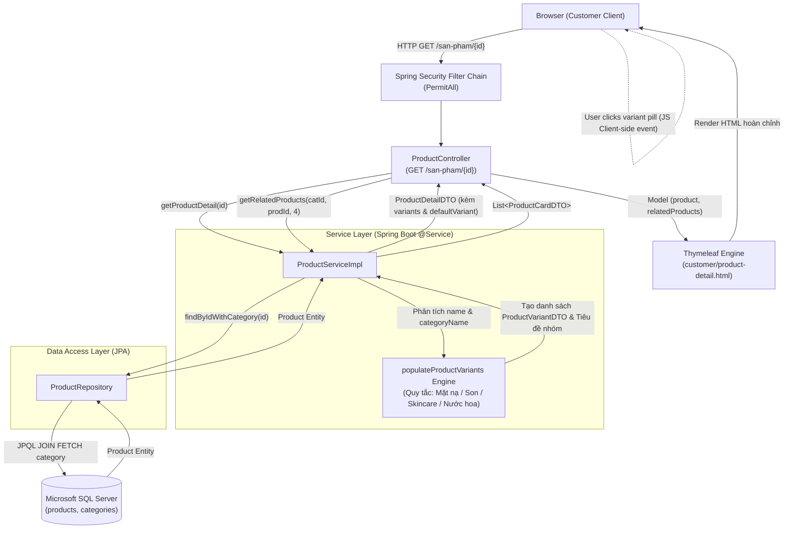
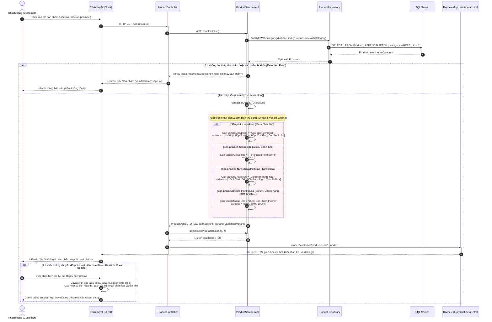
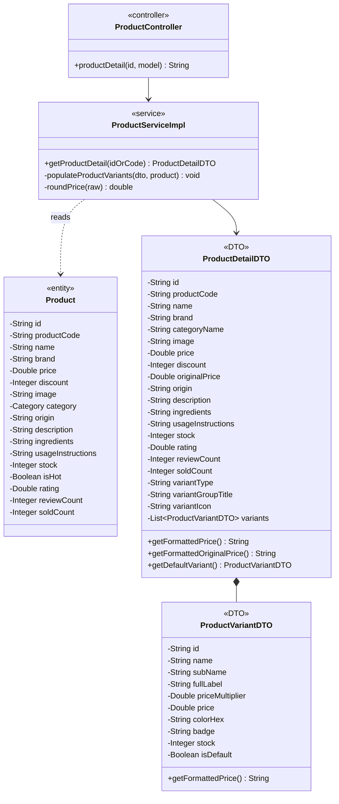
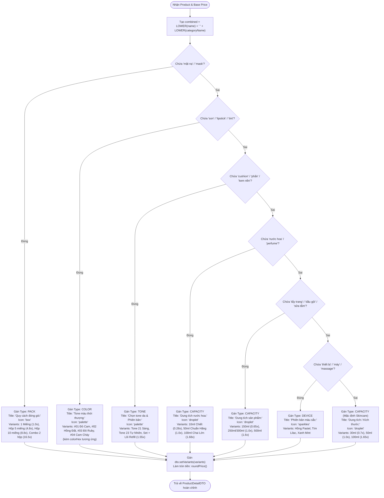

# Mermaid Diagrams: customer-view-product-detail

Tài liệu thiết kế kiến trúc, luồng xử lý và thuật toán phân loại biến thể động cho Use Case **Khách hàng xem thông tin chi tiết sản phẩm và chọn phân loại biến thể** (`uc003d-customer-view-product-detail`).

---

## 1. System Architecture

Biểu diễn luồng phân lớp SSR và xử lý sinh biến thể động (**Dynamic Variant Engine**) tại Service Layer trước khi đưa sang Thymeleaf View Engine và tương tác thời gian thực tại Client.

---

## 2. Sequence Diagram

Mô tả chi tiết chu kỳ Request-Response khi xem chi tiết sản phẩm, thuật toán sinh biến thể động trên server, và tương tác cập nhật giá tức thì tại client.

---

## 3. Class Diagram

Mô hình cấu trúc lớp chi tiết các Entity, DTOs và quan hệ phục vụ use case `customer-view-product-detail`.

---

## 4. Flowchart: Thuật Toán Quyết Định Nhóm Phân Loại (Dynamic Variant Decision Tree)

