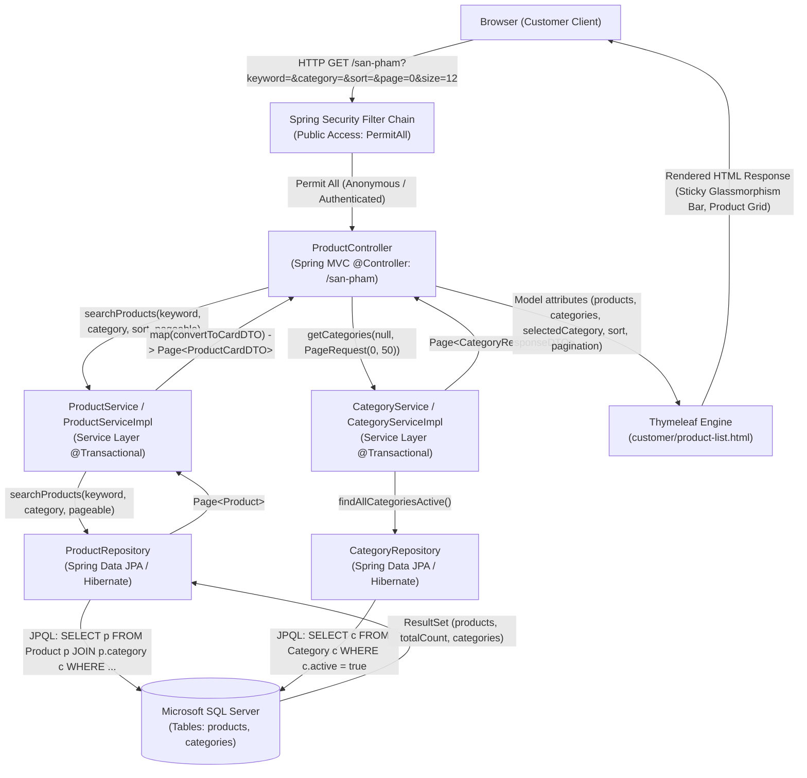
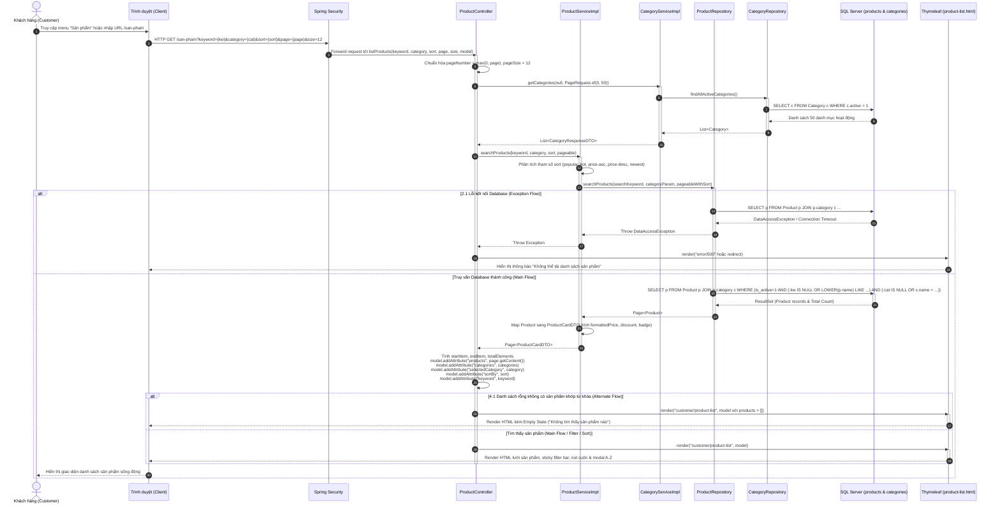
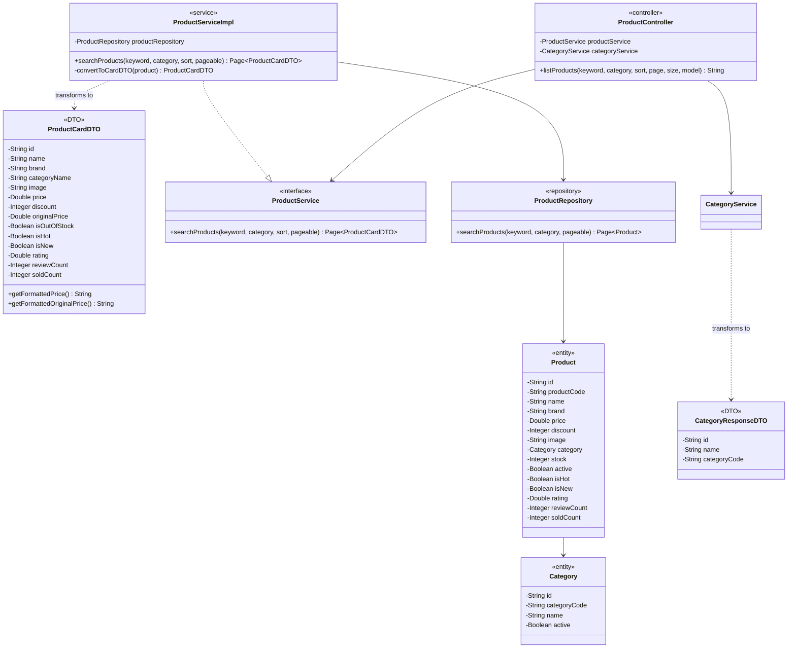

# Mermaid Diagrams: customer-view-products

Tài liệu thiết kế kiến trúc và luồng xử lý chi tiết cho Use Case **Khách hàng duyệt danh sách sản phẩm, tìm kiếm và lọc danh mục** (`uc002d-customer-view-products`).

---

## 1. System Architecture

Biểu diễn luồng phân lớp Server-Side Rendering (SSR) từ trình duyệt người dùng qua tầng bảo mật Spring Security, Spring MVC Controller, Service Layer, Spring Data JPA Repository đến cơ sở dữ liệu Microsoft SQL Server.

---

## 2. Sequence Diagram

Mô tả chi tiết chu kỳ Request-Response, bao gồm Main Flow (duyệt sản phẩm), Alternate Flows (tìm kiếm theo từ khóa, lọc theo danh mục, sắp xếp giá/bán chạy/mới nhất, chuyển trang) và Exception Flows (lỗi kết nối cơ sở dữ liệu, không tìm thấy sản phẩm).

---

## 3. Class Diagram

Mô hình cấu trúc lớp chi tiết giữa Entity, DTO, Repository, Service và Controller tham gia trong use case `customer-view-products`.

