# SƠ ĐỒ TỔNG QUAN USE CASE HỆ THỐNG (SYSTEM USE CASE DIAGRAM)
## HỆ THỐNG QUẢN LÝ VÀ BÁN MỸ PHẨM TRỰC TUYẾN PINKYCLOUD

---

## 1. GIỚI THIỆU VÀ PHÂN ĐỊNH TÁC NHÂN (ACTORS)

Sơ đồ System Use Case Diagram thể hiện toàn diện kiến trúc chức năng của Hệ thống PinkyCloud dưới góc nhìn của các tác nhân (Actors) bên ngoài tương tác với hệ thống. Sơ đồ tuân thủ chặt chẽ các nguyên lý mô hình hóa UML nâng cao:
- **Tính kế thừa Actor (Generalization):** Tái sử dụng các ca sử dụng nền tảng giữa các cấp độ người dùng.
- **Phân rã ranh giới hệ thống (Subsystem Boundaries):** Tách bạch rõ rành giữa trải nghiệm người tiêu dùng trực tuyến (*Storefront Subsystem*) và nghiệp vụ quản trị vận hành nội bộ (*Admin Operations Subsystem*).
- **Mối quan hệ Cấu trúc Chức năng (`<<include>>` và `<<extend>>`):** Phản ánh chính xác các luồng tiền xử lý bắt buộc, xác thực logic nghiệp vụ và các nhánh mở rộng điều kiện.

### 1.1. Bảng Định nghĩa Tác nhân (Actor Catalog)

| Tác Nhân (Actor) | Bản chất Vai trò | Phạm vi Quyền hạn & Trách nhiệm Nghiệp vụ |
| :--- | :--- | :--- |
| **Khách Vãng Lai (Guest)** | Người dùng đại chúng | Người dùng truy cập công khai vào website; có quyền khám phá trang chủ, xem danh mục mỹ phẩm, xem chi tiết sản phẩm & đánh giá, tìm kiếm sản phẩm và duy trì túi mua sắm tạm thời (Giỏ hàng). |
| **Khách Hàng (Customer)** | Người mua định danh | Kế thừa toàn bộ quyền của Khách Vãng Lai, đồng thời thực hiện hành vi tạo đơn hàng, áp dụng các chính sách ưu đãi (Mã giảm giá, Điểm thưởng thành viên) và xác nhận thanh toán. |
| **Quản Trị Viên (Admin)** | Nhân sự quản trị nội bộ | Nhân sự được cấp tài khoản bảo mật; chịu trách nhiệm toàn trình về quản lý danh mục, quản lý sản phẩm mỹ phẩm, xử lý đơn hàng, điều chỉnh số lượng thực xuất kho và theo dõi báo cáo doanh thu. |

---

## 2. SƠ ĐỒ SYSTEM USE CASE DIAGRAM TỔNG THỂ (MERMAID UML)

```mermaid
flowchart LR
    %% ==========================================
    %% 1. ĐỊNH NGHĨA ACTORS & KẾ THỪA
    %% ==========================================
    KhachVangLai((Khách Vãng Lai))
    KhachHang((Khách Hàng))
    Admin((Quản Trị Viên))

    KhachHang -. "<<kế thừa>>" .-> KhachVangLai

    %% ==========================================
    %% 2. RANH GIỚI HỆ THỐNG (SYSTEM BOUNDARY)
    %% ==========================================
    subgraph System["Hệ thống Quản lý & Bán Mỹ phẩm PinkyCloud"]

        %% ------------------------------------------
        %% 2.1. PHÂN HỆ MUA SẮM TRỰC TUYẾN (STOREFRONT)
        %% ------------------------------------------
        subgraph Storefront["Phân hệ Mua sắm Trực tuyến (Storefront Subsystem)"]
            UC_Home([UC01: Xem Trang chủ & Sản phẩm Nổi bật])
            UC_ViewCat([UC02: Xem Danh sách Sản phẩm theo Danh mục])
            UC_ViewDetail([UC03: Xem Chi tiết Sản phẩm & Đánh giá])
            UC_Search([UC04: Tìm kiếm & Lọc Sản phẩm])
            UC_Cart([UC05: Quản lý Giỏ hàng Mua sắm])
            UC_Checkout([UC06: Đặt hàng & Tiến hành Thanh toán])
            
            %% Use Cases phụ thuộc & mở rộng của Storefront
            UC_ValidateInfo([UC06.1: Kiểm tra Thông tin Giao nhận])
            UC_CalcTotal([UC06.2: Tính Tổng tiền, Phí ship & Ưu đãi])
            UC_CheckStock([UC06.3: Kiểm tra & Khóa Tồn kho Thực tế])
            UC_ApplyVoucher([UC06.4: Áp dụng Mã Giảm giá - Voucher])
            UC_RedeemPoints([UC06.5: Tiêu Điểm thưởng Tích lũy Loyalty])
        end

        %% ------------------------------------------
        %% 2.2. PHÂN HỆ QUẢN TRỊ NGHIỆP VỤ NỘI BỘ (ADMIN)
        %% ------------------------------------------
        subgraph Admin_Section["Phân hệ Quản trị Nghiệp vụ Nội bộ (Admin Operations)"]
            UC_Login([UC07: Đăng nhập Quản trị Bảo mật])
            
            %% Module Quản lý Danh mục
            UC_ManageCat([UC08: Quản lý Danh mục Hàng hóa])
            UC_ViewCatList([UC08.1: Xem Danh sách Danh mục])
            UC_AddCat([UC08.2: Thêm Danh mục Mới])
            UC_EditCat([UC08.3: Cập nhật Thông tin Danh mục])
            UC_DelCat([UC08.4: Xóa Danh mục])
            UC_CheckDupCat([UC08.5: Kiểm tra Trùng lặp Tên Danh mục])
            UC_CheckCatProd([UC08.6: Kiểm tra Ràng buộc Khóa ngoại Sản phẩm])

            %% Module Quản lý Sản phẩm
            UC_ManageProd([UC09: Quản lý Sản phẩm Mỹ phẩm])
            UC_ViewAdminProd([UC09.1: Xem Danh sách Sản phẩm Quản trị])
            UC_AdminSearch([UC09.2: Tìm kiếm & Lọc Sản phẩm Quản trị])
            UC_AddProd([UC09.3: Thêm Sản phẩm Mới])
            UC_EditProd([UC09.4: Cập nhật Thông tin Sản phẩm])
            UC_DelProd([UC09.5: Xóa / Ẩn Sản phẩm])
            UC_ValidateProd([UC09.6: Xác thực Dữ liệu & Ảnh Sản phẩm])

            %% Module Quản lý Đơn hàng
            UC_ManageOrder([UC10: Quản lý Đơn hàng & Xử lý Giao nhận])
            UC_ViewOrderList([UC10.1: Xem Danh sách Đơn hàng])
            UC_ViewOrderDetail([UC10.2: Xem Chi tiết Đơn hàng])
            UC_UpdateOrderQty([UC10.3: Điều chỉnh Số lượng Hàng Thực xuất])
            UC_UpdateStatus([UC10.4: Cập nhật Trạng thái Vận chuyển])
            UC_RecalcOrder([UC10.5: Tự động Tính lại Tiền & Chiết khấu])
            UC_AdjustInventory([UC10.6: Hoàn trả / Bù trừ Tồn kho Tự động])

            %% Module Báo cáo Thống kê
            UC_ViewStats([UC11: Xem Báo cáo & Thống kê Doanh số])
        end

    end

    %% ==========================================
    %% 3. TƯƠNG TÁC CỦA TÁC NHÂN KHÁCH VÃNG LAI
    %% ==========================================
    KhachVangLai --> UC_Home
    KhachVangLai --> UC_ViewCat
    KhachVangLai --> UC_ViewDetail
    KhachVangLai --> UC_Cart

    %% Mở rộng tìm kiếm từ duyệt danh mục
    UC_Search -.->|"&lt;&lt;extend&gt;&gt;"| UC_ViewCat

    %% ==========================================
    %% 4. TƯƠNG TÁC CỦA TÁC NHÂN KHÁCH HÀNG
    %% ==========================================
    KhachHang --> UC_Checkout

    %% Quan hệ Include & Extend trong Phân hệ Mua sắm
    UC_Checkout -.->|"&lt;&lt;include&gt;&gt;"| UC_ValidateInfo
    UC_Checkout -.->|"&lt;&lt;include&gt;&gt;"| UC_CalcTotal
    UC_Checkout -.->|"&lt;&lt;include&gt;&gt;"| UC_CheckStock
    UC_ApplyVoucher -.->|"&lt;&lt;extend&gt;&gt;"| UC_Checkout
    UC_RedeemPoints -.->|"&lt;&lt;extend&gt;&gt;"| UC_Checkout

    %% ==========================================
    %% 5. TƯƠNG TÁC CỦA TÁC NHÂN QUẢN TRỊ VIÊN
    %% ==========================================
    Admin --> UC_Login
    Admin --> UC_ManageCat
    Admin --> UC_ManageProd
    Admin --> UC_ManageOrder
    Admin --> UC_ViewStats

    %% ==========================================
    %% 6. BÓC TÁCH CRUD & QUAN HỆ NỘI BỘ ADMIN
    %% ==========================================
    %% Quản lý Danh mục
    UC_ManageCat --> UC_ViewCatList
    UC_ManageCat --> UC_AddCat
    UC_ManageCat --> UC_EditCat
    UC_ManageCat --> UC_DelCat
    UC_AddCat -.->|"&lt;&lt;include&gt;&gt;"| UC_CheckDupCat
    UC_EditCat -.->|"&lt;&lt;include&gt;&gt;"| UC_CheckDupCat
    UC_DelCat -.->|"&lt;&lt;include&gt;&gt;"| UC_CheckCatProd

    %% Quản lý Sản phẩm
    UC_ManageProd --> UC_ViewAdminProd
    UC_ManageProd --> UC_AddProd
    UC_ManageProd --> UC_EditProd
    UC_ManageProd --> UC_DelProd
    UC_AdminSearch -.->|"&lt;&lt;extend&gt;&gt;"| UC_ViewAdminProd
    UC_AddProd -.->|"&lt;&lt;include&gt;&gt;"| UC_ValidateProd
    UC_EditProd -.->|"&lt;&lt;include&gt;&gt;"| UC_ValidateProd

    %% Quản lý Đơn hàng
    UC_ManageOrder --> UC_ViewOrderList
    UC_ManageOrder --> UC_ViewOrderDetail
    UC_ManageOrder --> UC_UpdateOrderQty
    UC_ManageOrder --> UC_UpdateStatus
    UC_UpdateOrderQty -.->|"&lt;&lt;include&gt;&gt;"| UC_RecalcOrder
    UC_UpdateOrderQty -.->|"&lt;&lt;include&gt;&gt;"| UC_AdjustInventory
```

---

## 3. TỪ ĐIỂN VÀ ĐẶC TẢ MA TRẬN CA SỬ DỤNG (USE CASE DICTIONARY)

### 3.1. Phân hệ Mua sắm Trực tuyến (Storefront Subsystem)

| Mã UC | Tên Ca Sử Dụng | Tác Nhân Chính | Tiền Điều Kiện (Precondition) | Hậu Điều Kiện (Postcondition) | Mục Đích Nghiệp Vụ |
| :--- | :--- | :--- | :--- | :--- | :--- |
| **UC01** | Xem Trang chủ & Sản phẩm Nổi bật | Khách Vãng Lai | Người dùng truy cập đường dẫn trang chủ website. | Hiển thị banner khuyến mãi, danh mục chủ đạo và danh sách mỹ phẩm bán chạy/mới nhất. | Giúp khách hàng nắm bắt nhanh chương trình ưu đãi và danh mục sản phẩm nổi bật. |
| **UC02** | Xem Danh sách Sản phẩm theo Danh mục | Khách Vãng Lai | Người dùng chọn một danh mục hàng hóa cụ thể. | Hiển thị danh sách sản phẩm thuộc danh mục kèm bộ phân trang và sắp xếp. | Cung cấp cái nhìn trực quan, phân loại hàng hóa rõ ràng theo chủng loại mỹ phẩm. |
| **UC03** | Xem Chi tiết Sản phẩm & Đánh giá | Khách Vãng Lai | Người dùng nhấp chọn vào một sản phẩm cụ thể. | Hiển thị đầy đủ hình ảnh, mô tả chi tiết, giá bán, dung tích, xuất xứ và số lượng tồn khả dụng. | Giúp khách hàng tìm hiểu kỹ lưỡng công dụng, thành phần trước khi ra quyết định mua. |
| **UC04** | Tìm kiếm & Lọc Sản phẩm | Khách Vãng Lai | Đang ở trang danh sách sản phẩm (`UC02`). | Danh sách sản phẩm được lọc động theo từ khóa, khoảng giá, thương hiệu. | **`<<extend>>` của UC02:** Hỗ trợ khách hàng nhanh chóng định vị sản phẩm mong muốn. |
| **UC05** | Quản lý Giỏ hàng Mua sắm | Khách Vãng Lai | Người dùng thực hiện thao tác thêm sản phẩm hoặc mở giỏ hàng. | Giỏ hàng tạm thời được cập nhật (thêm mới, tăng/giảm số lượng, xóa sản phẩm, tính tạm tính). | Lưu trữ danh sách sản phẩm khách dự định mua trong phiên làm việc mà **không khóa kho ảo**. |
| **UC06** | Đặt hàng & Tiến hành Thanh toán | Khách Hàng | Khách hàng đã có ít nhất 01 sản phẩm hợp lệ trong giỏ hàng. | Đơn hàng mới được khởi tạo thành công ở trạng thái `CHO_XAC_NHAN`, trừ kho thực tế. | Hoàn tất giao dịch mua sắm trực tuyến và tạo cam kết đơn hàng giữa khách và cửa hàng. |
| **UC06.1** | Kiểm tra Thông tin Giao nhận | Hệ thống (Nội bộ) | Khách hàng nhấn xác nhận đặt hàng tại `UC06`. | Họ tên, số điện thoại, địa chỉ nhận hàng được kiểm tra hợp lệ. | **`<<include>>` của UC06:** Đảm bảo đủ thông tin chính xác để nhân viên giao hàng liên hệ. |
| **UC06.2** | Tính Tổng tiền, Phí ship & Ưu đãi | Hệ thống (Nội bộ) | Địa chỉ và sản phẩm được xác định tại `UC06`. | Tự động tính tiền hàng, cộng cước vận chuyển, trừ chiết khấu voucher/điểm. | **`<<include>>` của UC06:** Đảm bảo tính toán chính xác tổng thanh toán theo đúng thứ tự 4 tầng ưu đãi. |
| **UC06.3** | Kiểm tra & Khóa Tồn kho Thực tế | Hệ thống (Nội bộ) | Đơn hàng sẵn sàng được lưu tại `UC06`. | Tồn kho của từng mã sản phẩm được kiểm tra $\ge$ số lượng đặt và trừ kho ngay lập tức. | **`<<include>>` của UC06:** Ngăn chặn tình trạng bán vượt tồn kho (Overselling / Race condition). |
| **UC06.4** | Áp dụng Mã Giảm giá (Voucher) | Khách Hàng | Khách hàng nhập mã khuyến mãi còn hiệu lực tại `UC06`. | Giá trị giảm trừ hợp lệ được áp dụng vào tổng hóa đơn trước điểm thưởng. | **`<<extend>>` của UC06:** Cho phép khách hưởng ưu đãi giảm giá theo chiến dịch marketing. |
| **UC06.5** | Tiêu Điểm thưởng Tích lũy | Khách Hàng | Khách hàng có $\ge 10$ điểm thưởng tích lũy trong tài khoản. | Số điểm được quy đổi (1 điểm = 1.000đ) và giảm trừ tối đa 50% tiền hàng sau voucher. | **`<<extend>>` của UC06:** Tri ân khách hàng thân thiết, kích thích tái mua sắm. |

---

### 3.2. Phân hệ Quản trị Nghiệp vụ Nội bộ (Admin Operations Subsystem)

| Mã UC | Tên Ca Sử Dụng | Tác Nhân Chính | Tiền Điều Kiện (Precondition) | Hậu Điều Kiện (Postcondition) | Mục Đích Nghiệp Vụ |
| :--- | :--- | :--- | :--- | :--- | :--- |
| **UC07** | Đăng nhập Quản trị Bảo mật | Quản Trị Viên | Quản trị viên truy cập trang quản trị nội bộ. | Xác thực thành công thông tin đăng nhập và cấp quyền truy cập bảng điều khiển. | Bảo vệ dữ liệu doanh nghiệp và kiểm soát quyền hạn truy cập của cán bộ nội bộ. |
| **UC08** | Quản lý Danh mục Hàng hóa | Quản Trị Viên | Đã đăng nhập với quyền Quản trị (`UC07`). | Danh mục mỹ phẩm được duy trì, cập nhật chính xác theo cấu trúc kinh doanh. | Ca sử dụng tổng quát điều phối các thao tác CRUD danh mục sản phẩm. |
| **UC08.1** | Xem Danh sách Danh mục | Quản Trị Viên | Truy cập module Quản lý Danh mục. | Hiển thị danh sách tất cả các danh mục hàng hóa kèm số lượng sản phẩm liên kết. | Theo dõi và rà soát cơ cấu ngành hàng mỹ phẩm của cửa hàng. |
| **UC08.2** | Thêm Danh mục Mới | Quản Trị Viên | Nhập thông tin tên và mô tả danh mục mới. | Danh mục mới được tạo và ghi nhận vào cơ sở dữ liệu. | Mở rộng thêm các nhóm mặt hàng mỹ phẩm mới (ví dụ: Chăm sóc tóc, Son môi...). |
| **UC08.3** | Cập nhật Thông tin Danh mục | Quản Trị Viên | Chọn một danh mục đang tồn tại để sửa đổi. | Thông tin danh mục được cập nhật lại theo dữ liệu mới. | Điều chỉnh tên gọi hoặc mô tả danh mục khi có sự thay đổi định vị kinh doanh. |
| **UC08.4** | Xóa Danh mục | Quản Trị Viên | Chọn một danh mục cần xóa khỏi hệ thống. | Danh mục được loại bỏ hoàn toàn nếu không còn sản phẩm trực thuộc. | Dọn dẹp các ngành hàng không còn kinh doanh. |
| **UC08.5** | Kiểm tra Trùng lặp Tên Danh mục | Hệ thống (Nội bộ) | Kích hoạt khi thực hiện `UC08.2` hoặc `UC08.3`. | Ngăn chặn việc tạo hoặc đổi tên danh mục trùng với danh mục đã có sẵn. | **`<<include>>` của UC08.2, UC08.3:** Đảm bảo tính duy nhất và nhất quán của cây danh mục. |
| **UC08.6** | Kiểm tra Ràng buộc Khóa ngoại SP | Hệ thống (Nội bộ) | Kích hoạt khi thực hiện thao tác xóa danh mục `UC08.4`. | Chặn thao tác xóa nếu danh mục đang chứa ít nhất 01 sản phẩm; yêu cầu chuyển danh mục trước. | **`<<include>>` của UC08.4:** Đảm bảo toàn vẹn dữ liệu, tránh sản phẩm bị "mồ côi" danh mục. |
| **UC09** | Quản lý Sản phẩm Mỹ phẩm | Quản Trị Viên | Đã đăng nhập với quyền Quản trị (`UC07`). | Danh mục sản phẩm được quản lý toàn diện về thông tin, giá bán và tồn kho. | Ca sử dụng tổng quát điều phối các hoạt động CRUD sản phẩm mỹ phẩm. |
| **UC09.1** | Xem Danh sách Sản phẩm Quản trị | Quản Trị Viên | Truy cập module Quản lý Sản phẩm. | Hiển thị bảng tổng hợp sản phẩm gồm ảnh, tên, mã, giá bán, giá vốn, tồn kho, trạng thái. | Theo dõi tình trạng kinh doanh và mức độ sẵn sàng của hàng hóa trong kho. |
| **UC09.2** | Tìm kiếm & Lọc Sản phẩm Quản trị | Quản Trị Viên | Đang ở giao diện `UC09.1`. | Bảng danh sách được lọc theo từ khóa tên, mã vạch, danh mục, khoảng giá hoặc tình trạng kho. | **`<<extend>>` của UC09.1:** Giúp quản trị viên nhanh chóng tìm kiếm sản phẩm cần thao tác. |
| **UC09.3** | Thêm Sản phẩm Mới | Quản Trị Viên | Nhập đầy đủ thông số sản phẩm và upload hình ảnh. | Sản phẩm mới được tạo thành công và xuất hiện trên gian hàng trực tuyến. | Đưa các dòng mỹ phẩm mới nhập về lên hệ sinh thái bán hàng. |
| **UC09.4** | Cập nhật Thông tin Sản phẩm | Quản Trị Viên | Chọn sản phẩm và điều chỉnh giá, mô tả, ảnh, dung tích. | Thông tin sản phẩm được cập nhật đồng bộ toàn hệ thống. | Cập nhật lại giá niêm yết, công thức cải tiến hoặc thay đổi bao bì sản phẩm. |
| **UC09.5** | Xóa / Ẩn Sản phẩm | Quản Trị Viên | Chọn sản phẩm ngừng kinh doanh. | Sản phẩm được xóa hoặc chuyển sang trạng thái "Ngừng kinh doanh" (Ẩn khỏi storefront). | Quản lý vòng đời sản phẩm, ngăn khách hàng đặt mua các mặt hàng đã đứt nguồn cung. |
| **UC09.6** | Xác thực Dữ liệu & Ảnh Sản phẩm | Hệ thống (Nội bộ) | Kích hoạt khi thực hiện `UC09.3` hoặc `UC09.4`. | Kiểm tra tính hợp lệ của giá bán (>0), số lượng tồn ($\ge 0$), định dạng ảnh hợp lệ. | **`<<include>>` của UC09.3, UC09.4:** Bảo đảm chất lượng hiển thị và tính đúng đắn dữ liệu. |
| **UC10** | Quản lý Đơn hàng & Giao nhận | Quản Trị Viên | Đã đăng nhập với quyền Quản trị (`UC07`). | Đơn hàng được xử lý, đóng gói, điều chỉnh thực xuất và bàn giao vận chuyển kịp thời. | Ca sử dụng tổng quát kiểm soát toàn bộ quy trình hoàn tất đơn hàng (Fulfillment). |
| **UC10.1** | Xem Danh sách Đơn hàng | Quản Trị Viên | Truy cập module Quản lý Đơn hàng. | Hiển thị danh sách các đơn hàng theo dòng thời gian kèm trạng thái giao dịch. | Giúp nhân viên điều vận nắm bắt khối lượng đơn hàng cần xử lý trong ngày. |
| **UC10.2** | Xem Chi tiết Đơn hàng | Quản Trị Viên | Nhấp chọn một đơn hàng cụ thể. | Hiển thị chi tiết khách hàng, địa chỉ nhận, danh sách từng sản phẩm, giá bán, giảm trừ và tổng tiền. | Rà soát thông tin để tiến hành nhặt hàng và đóng gói sản phẩm. |
| **UC10.3** | Điều chỉnh Số lượng Thực xuất | Quản Trị Viên | Đơn hàng đang ở trạng thái `DANG_CHUAN_BI` và phát sinh biến động thực tế (hàng lỗi/khách xin đổi). | Số lượng mặt hàng trong đơn được cập nhật lại theo số lượng thực tế đóng gói. | Xử lý linh hoạt các tình huống thực tế tại kho khi sản phẩm bị móp méo/hỏng hóc cận date. |
| **UC10.4** | Cập nhật Trạng thái Vận chuyển | Quản Trị Viên | Đơn hàng hoàn tất đóng gói hoặc có phản hồi từ đơn vị vận chuyển. | Trạng thái đơn được chuyển đổi (`DANG_GIAO`, `HOAN_TAT`, `DA_HUY`). | Đồng bộ trạng thái giao nhận giữa cửa hàng, đối tác vận chuyển và khách hàng. |
| **UC10.5** | Tự động Tính lại Tiền & Chiết khấu | Hệ thống (Nội bộ) | Kích hoạt ngay khi nhân viên điều chỉnh số lượng ở `UC10.3`. | Thành tiền từng dòng, tổng tiền hàng, mức giảm trừ voucher và điểm thưởng được tính toán lại. | **`<<include>>` của UC10.3:** Đảm bảo số tiền khách phải trả khớp chính xác với số lượng thực xuất. |
| **UC10.6** | Hoàn trả / Bù trừ Tồn kho Tự động | Hệ thống (Nội bộ) | Kích hoạt khi điều chỉnh `UC10.3` hoặc hủy đơn tại `UC10.4`. | Số lượng chênh lệch (giảm đi) được tự động cộng hoàn trả ngay về kho khả dụng của sản phẩm. | **`<<include>>` của UC10.3:** Triệt tiêu hoàn toàn rủi ro lệch kho giữa số liệu hệ thống và kệ hàng vật lý. |
| **UC11** | Xem Báo cáo & Thống kê Doanh số | Quản Trị Viên | Đã đăng nhập với quyền Quản trị (`UC07`). | Hiển thị biểu đồ doanh thu theo thời gian, tỷ lệ đơn hủy, top sản phẩm bán chạy nhất. | Giúp ban quản lý đánh giá hiệu quả kinh doanh và hoạch định chiến lược nhập hàng. |

---

## 4. NGUYÊN TẮC THIẾT KẾ & TÍNH CHUẨN MỰC HỌC THUẬT CỦA SƠ ĐỒ

1. **Tuân thủ Chuẩn mực Mô hình hóa Phần mềm (Academic Software Engineering Standard):**
   - Không sử dụng các thuật ngữ nội bộ kỹ thuật cơ sở dữ liệu (`SQL Query`, `Session Storage`, `Repository`) làm tên Use Case. Mọi tên gọi đều đại diện cho **Hành vi nghiệp vụ mang lại giá trị cụ thể** cho Tác nhân.
   - Toàn bộ các Use Case đều bắt đầu bằng Động từ hành động rõ ràng (*Xem, Thêm, Cập nhật, Xóa, Đặt hàng, Điều chỉnh, Kiểm tra, Tính toán*).
2. **Tính Chính xác của Quan hệ `<<include>>`:**
   - Sử dụng cho các hành vi nghiệp vụ **bắt buộc phải thực hiện** như một phần không thể tách rời của Use Case gốc (Ví dụ: Đặt hàng bắt buộc phải kiểm tra thông tin, tính tổng tiền và khóa kho tồn thực tế; Điều chỉnh số lượng hàng bắt buộc phải tính lại tiền và cân bằng lại tồn kho).
3. **Tính Chính xác của Quan hệ `<<extend>>`:**
   - Sử dụng cho các hành vi **tùy chọn hoặc có điều kiện bổ sung** mở rộng Use Case cơ sở (Ví dụ: Áp dụng voucher hoặc Tiêu điểm thưởng chỉ diễn ra khi khách hàng có nhu cầu và đáp ứng đủ điều kiện tích lũy; Tìm kiếm sản phẩm mở rộng từ việc duyệt danh mục).
4. **Phân rã CRUD Triệt để (CRUD Decomposition):**
   - Không gom chung một khối mờ nhạt "Quản lý...", toàn bộ các ca quản trị lớn (Danh mục, Sản phẩm, Đơn hàng) đều được phân rã thành các Use Case chuyên biệt kèm các ràng buộc toàn vẹn dữ liệu tương ứng.
