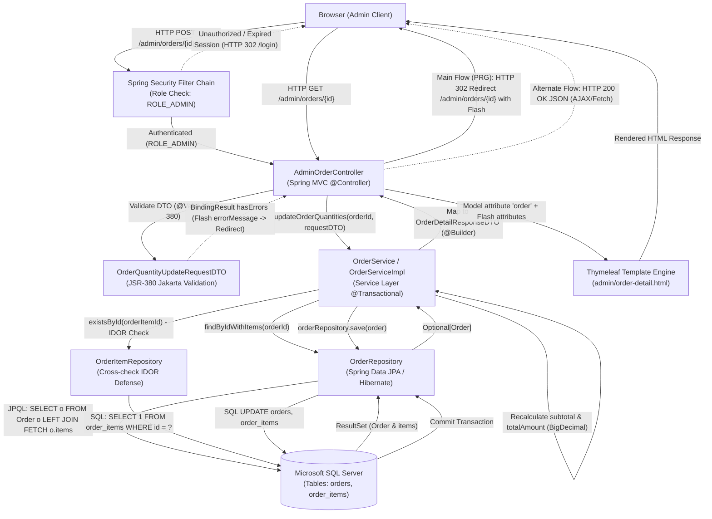
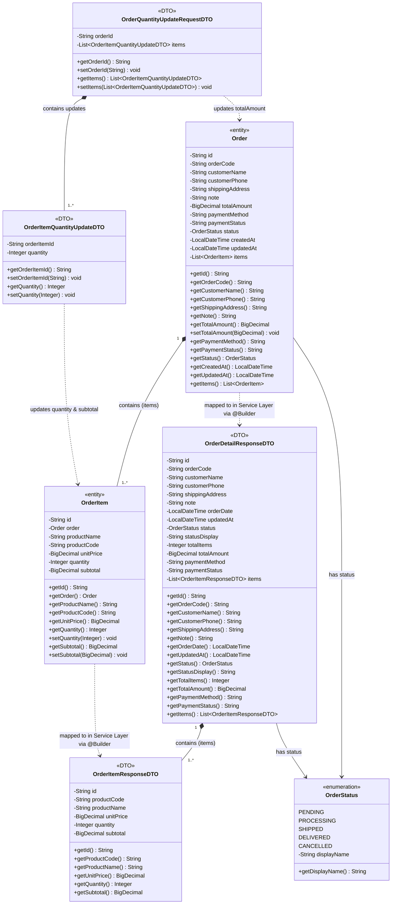

# Mermaid Diagrams: uc002b-admin-order-update-quantity

Tài liệu thiết kế kiến trúc và mô hình luồng tương tác chi tiết cho Use Case **Quản trị viên cập nhật số lượng mặt hàng trong đơn hàng trực tuyến** (`admin-order-update-quantity-b` / `uc002b-admin-order-update-quantity`).

---

## 1. System Architecture

Biểu diễn luồng phân lớp kiến trúc Server-Side Rendering (SSR) từ Trình duyệt (Admin Client) qua bộ lọc phân quyền Spring Security, Spring MVC Controller tiếp nhận và xác thực JSR-380 DTO, chuyển giao cho Service Layer thực thi giao dịch ACID (`@Transactional`), tương tác với Spring Data JPA Repositories để truy vấn và cập nhật Microsoft SQL Server, sau đó phản hồi theo mô hình Post-Redirect-Get (PRG) hoặc JSON Payload (AJAX/Fetch).



---

## 2. Sequence Diagram

Mô tả chi tiết chu trình xử lý nghiệp vụ đầy đủ của Use Case cập nhật số lượng mặt hàng trong đơn hàng, ánh xạ chính xác Luồng chính (Main Flow), các Luồng thay thế (Alternate Flows: chỉ sửa 1 món, đặt lại giá trị ban đầu trên UI, cập nhật qua AJAX/Fetch) và tất cả các Luồng ngoại lệ (Exception Flows: hết hạn phiên, vi phạm validation JSR-380, đơn hàng không tồn tại, trạng thái đơn không được phép sửa, mặt hàng không tồn tại, phát hiện tấn công IDOR, đơn hàng rỗng, lỗi kết nối CSDL).

```mermaid
sequenceDiagram
    autonumber
    actor Admin as Quản trị viên (Admin)
    participant Browser as Trình duyệt (Client)
    participant Security as Spring Security Filter Chain
    participant Controller as AdminOrderController
    participant Service as OrderServiceImpl
    participant OrderRepo as OrderRepository
    participant ItemRepo as OrderItemRepository
    participant DB as SQL Server (orders, order_items)
    participant View as Thymeleaf View (admin/order-detail)

    opt 1.3 Quản trị viên thay đổi số lượng nhưng nhấp 'Hủy thay đổi' / 'Đặt lại ban đầu' (Alternate Flow)
        Admin->>Browser: Nhấp 'Hủy thay đổi' / 'Đặt lại ban đầu'
        Browser->>Browser: JavaScript khôi phục giá trị số lượng ban đầu của bảng
        Note over Browser: Kết thúc luồng thay thế, không gửi request lên máy chủ
    end

    Admin->>Browser: Điều chỉnh số lượng mặt hàng và nhấn 'Lưu thay đổi'
    Browser->>Security: HTTP POST /admin/orders/{id}/items (Payload: OrderQuantityUpdateRequestDTO)

    alt 2.1.1 Phiên đăng nhập hết hạn hoặc thiếu ROLE_ADMIN (Exception Flow)
        Security-->>Browser: HTTP 302 Redirect /login ("Phiên làm việc hết hạn hoặc không có quyền...")
        Browser-->>Admin: Hiển thị màn hình đăng nhập
    else Quản trị viên có quyền ROLE_ADMIN hợp lệ (Main Flow)
        Security->>Controller: Forward request tới updateOrderQuantities(id, requestDTO, bindingResult, redirectAttributes)

        Controller->>Controller: Kiểm tra định dạng UUID của path variable {id}
        Controller->>Controller: Kiểm định tính hợp lệ của DTO qua JSR-380 (@Valid)

        alt 3.1.1 Dữ liệu Request vi phạm JSR-380 (@NotBlank, @NotNull, @Min(1), @Max(999), @NotEmpty items) (Exception Flow)
            Controller-->>Browser: HTTP 302 Redirect /admin/orders/{id} (Flash: "Dữ liệu cập nhật không hợp lệ...")
            Browser-->>Admin: Hiển thị lại trang chi tiết đơn hàng kèm cảnh báo lỗi nhập liệu
        else Dữ liệu đầu vào hợp lệ (Main Flow)
            Controller->>Service: updateOrderQuantities(trimmedId, requestDTO)
            Note over Service: Mở Transaction (@Transactional rollbackFor = Exception.class)

            Service->>OrderRepo: findByIdWithItems(orderId)
            OrderRepo->>DB: SELECT o FROM Order o LEFT JOIN FETCH o.items WHERE o.id = :id
            DB-->>OrderRepo: Trả về bản ghi Order kèm danh sách OrderItem liên quan
            OrderRepo-->>Service: return Optional[Order]

            alt 4.1.1 Đơn hàng không tồn tại trong hệ thống (Exception Flow)
                Service-->>Controller: throw OrderNotFoundException("Đơn hàng yêu cầu không tồn tại...")
                Controller-->>Browser: HTTP 302 Redirect /admin/orders (Flash: "Đơn hàng yêu cầu không tồn tại...")
                Browser-->>Admin: Quay lại trang danh sách đơn hàng kèm thông báo lỗi
            else Đơn hàng tồn tại (Main Flow)
                alt 5.1.1 Đơn hàng ở trạng thái cấm sửa (DELIVERED, CANCELLED, SHIPPED) (Exception Flow)
                    Service-->>Controller: throw InvalidOrderStatusException("Đơn hàng ở trạng thái [Status] không được phép thay đổi số lượng...")
                    Controller-->>Browser: HTTP 302 Redirect /admin/orders/{id} (Flash errorMessage)
                    Browser-->>Admin: Hiển thị lại trang chi tiết đơn hàng kèm banner thông báo từ chối
                else Đơn hàng ở trạng thái hợp lệ (PENDING hoặc PROCESSING) (Main Flow)
                    alt 7.1.1 Đơn hàng không có bất kỳ mặt hàng con nào (order.items rỗng hoặc null) (Exception Flow)
                        Service-->>Controller: throw IllegalStateException("Đơn hàng không có sản phẩm nào để cập nhật.")
                        Controller-->>Browser: HTTP 302 Redirect /admin/orders/{id} (Flash errorMessage)
                        Browser-->>Admin: Hiển thị lại trang chi tiết đơn hàng kèm thông báo
                    else Đơn hàng có danh sách mặt hàng (Main Flow)
                        
                        loop Duyệt qua từng phần tử trong requestDTO.items
                            Note over Service: Kiểm tra mặt hàng tồn tại trong order.items
                            alt Mặt hàng thuộc đơn hàng hiện tại (Main Flow)
                                Service->>Service: orderItem.setQuantity(newQuantity)
                                Service->>Service: subtotal = unitPrice.multiply(BigDecimal.valueOf(newQuantity))
                                Service->>Service: orderItem.setSubtotal(subtotal)
                            else Mặt hàng không tìm thấy trong order.items (Nghi vấn IDOR hoặc mã sai)
                                Service->>ItemRepo: existsById(orderItemId)
                                ItemRepo->>DB: SELECT COUNT(1) FROM order_items WHERE id = :id
                                DB-->>ItemRepo: Trả về kết quả kiểm tra
                                ItemRepo-->>Service: return boolean exists

                                alt 6.2.1 Mặt hàng tồn tại ở đơn khác - Phát hiện tấn công IDOR! (Exception Flow)
                                    Service->>Service: Log SLF4J WARN ("Security Alert: Attempted IDOR - OrderItem ... does not belong to Order ...")
                                    Service-->>Controller: throw InvalidOrderItemException("Mặt hàng cập nhật không thuộc về đơn hàng này.")
                                    Note over Service: Rollback Transaction 100%
                                    Controller-->>Browser: HTTP 302 Redirect /admin/orders/{id} (Flash: "Mặt hàng cập nhật không thuộc về đơn hàng này.")
                                    Browser-->>Admin: Hiển thị thông báo vi phạm bảo mật
                                else 6.1.1 Mặt hàng không tồn tại trong toàn bộ CSDL (Exception Flow)
                                    Service-->>Controller: throw OrderItemNotFoundException("Không tìm thấy mặt hàng cần cập nhật trong hệ thống.")
                                    Note over Service: Rollback Transaction 100%
                                    Controller-->>Browser: HTTP 302 Redirect /admin/orders/{id} (Flash: "Không tìm thấy mặt hàng cần cập nhật...")
                                    Browser-->>Admin: Hiển thị thông báo không tìm thấy mặt hàng
                                end
                            end
                        end

                        Service->>Service: Tính lại tổng tiền: totalAmount = sum(all orderItem.subtotal)
                        Service->>Service: order.setTotalAmount(totalAmount)

                        Service->>OrderRepo: save(order)
                        OrderRepo->>DB: UPDATE orders SET total_amount = ?, ...; UPDATE order_items SET quantity = ?, subtotal = ?...

                        alt 8.1.1 Lỗi kết nối CSDL hoặc lỗi DataAccessException khi lưu dữ liệu (Exception Flow)
                            DB-->>OrderRepo: Ném DataAccessException / SQLServerException
                            OrderRepo-->>Service: Ném DataAccessException
                            Note over Service: Spring Transaction Rollback toàn bộ thay đổi
                            Service-->>Controller: Lan truyền Exception
                            Controller-->>Browser: HTTP 302 Redirect /admin/orders/{id} (Flash: "Không thể lưu cập nhật số lượng vào lúc này...")
                            Browser-->>Admin: Hiển thị thông báo lỗi hệ thống
                        else Lưu CSDL thành công (Commit Transaction) (Main Flow)
                            DB-->>OrderRepo: Xác nhận ghi thành công (Commit Transaction)
                            OrderRepo-->>Service: return Order
                            Service->>Service: Map Order sang OrderDetailResponseDTO (@Builder)
                            Service-->>Controller: return OrderDetailResponseDTO

                            alt 1.5 & 1.6 Yêu cầu cập nhật gửi qua AJAX / Fetch API (Alternate Flow)
                                Controller-->>Browser: HTTP 200 OK (Content-Type: application/json, Body: OrderDetailResponseDTO)
                                Browser->>Browser: JavaScript DOM update số lượng, thành tiền, tổng tiền mà không tải lại trang
                                Browser-->>Admin: Hiển thị Toast thông báo thành công và dữ liệu mới
                            else Mô hình Post-Redirect-Get tiêu chuẩn (Main Flow)
                                Controller-->>Browser: HTTP 302 Redirect /admin/orders/{id} (Flash: "Cập nhật số lượng sản phẩm và tính lại tổng tiền...")
                                Browser->>Controller: HTTP GET /admin/orders/{id}
                                Controller->>View: render("admin/order-detail", model: { order: updatedDTO })
                                View-->>Browser: Trả về mã HTML trang chi tiết đơn hàng đã cập nhật
                                Browser-->>Admin: Hiển thị giao diện với số lượng mới, thành tiền mới và tổng thanh toán mới
                            end
                        end
                    end
                end
            end
        end
    end
```

---

## 3. Class Diagram

Mô hình hóa các thực thể JPA (`<<entity>>`), kiểu liệt kê (`<<enumeration>>`) và các lớp truyền tải dữ liệu DTO (`<<DTO>>`) tham gia trực tiếp vào Use Case Cập nhật số lượng mặt hàng trong đơn hàng trực tuyến.


