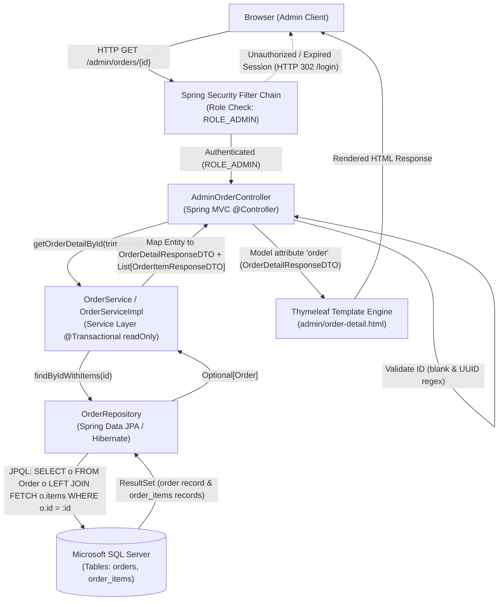
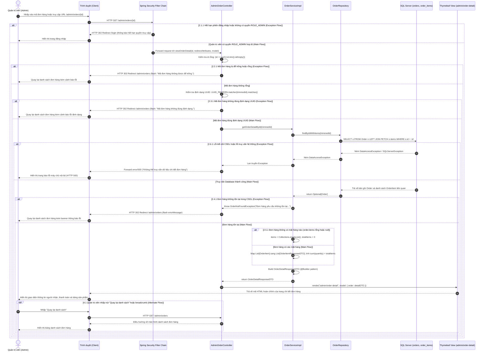
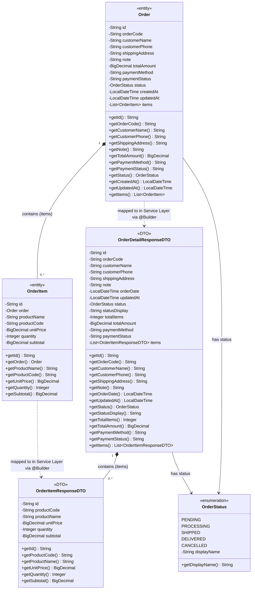

# Mermaid Diagrams: uc002d-admin-order-detail

Tài liệu thiết kế kiến trúc và mô hình luồng tương tác chi tiết cho Use Case **Quản trị viên xem chi tiết một đơn hàng trực tuyến** (`admin-order-detail-d` / `uc002d-admin-order-detail`).

---

## 1. System Architecture

Biểu diễn luồng phân lớp kiến trúc Server-Side Rendering (SSR) từ Trình duyệt (Admin Client) qua bộ lọc phân quyền Spring Security, Spring MVC Controller, Service Layer, Spring Data JPA Repository tới Microsoft SQL Server và hiển thị qua Thymeleaf Engine.

---

## 2. Sequence Diagram

Mô tả chu kỳ vòng đời của một Request-Response từ lúc Quản trị viên nhấp xem chi tiết một đơn hàng, biểu diễn đầy đủ Main Flow, Alternate Flows (truy cập trực tiếp URL, quay lại danh sách qua nút/breadcrumb) và Exception Flows (hết hạn phiên/thiếu quyền, mã đơn rỗng, mã đơn sai định dạng UUID, đơn hàng không tồn tại, đơn hàng không có mặt hàng, lỗi kết nối CSDL).

---

## 3. Class Diagram

Mô hình hóa các thực thể JPA (`<<entity>>`), kiểu liệt kê trạng thái (`<<enumeration>>`) và các lớp truyền tải dữ liệu (`<<DTO>>`) tham gia trực tiếp vào Use Case xem chi tiết đơn hàng.

