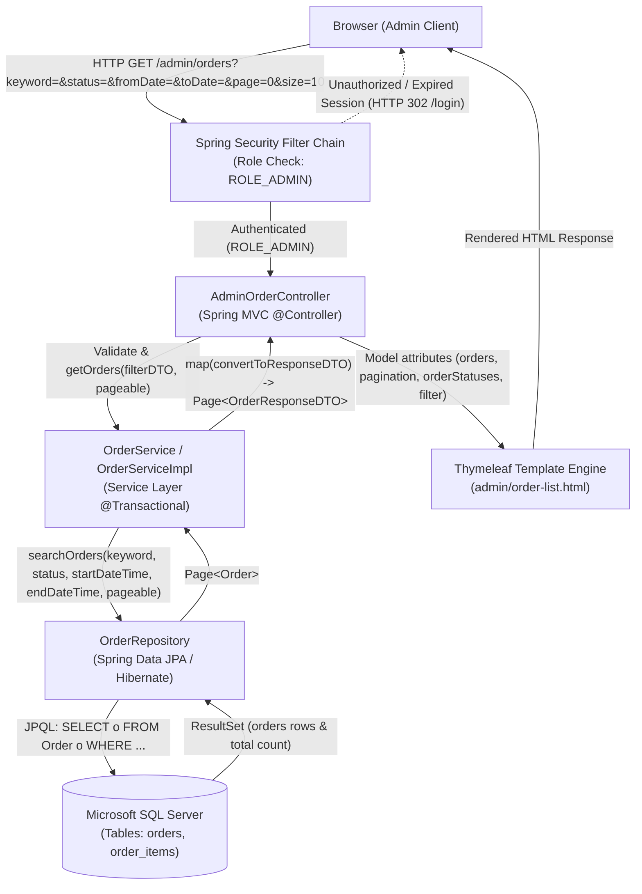
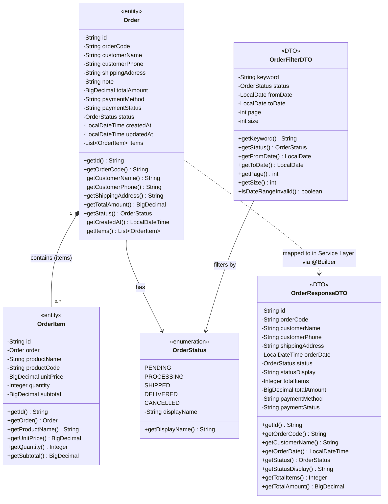

# Mermaid Diagrams: uc002d-admin-order-list

Tài liệu thiết kế kiến trúc và mô hình luồng tương tác chi tiết cho Use Case **Quản trị viên xem danh sách tất cả đơn hàng trực tuyến** (`uc002d-admin-order-list`).

---

## 1. System Architecture

Biểu diễn luồng phân lớp kiến trúc Server-Side Rendering (SSR) từ Trình duyệt (Admin Client) qua bộ lọc phân quyền Spring Security, Spring MVC Controller, Service Layer, Spring Data JPA Repository tới Microsoft SQL Server và hiển thị qua Thymeleaf Engine.



---

## 2. Sequence Diagram

Mô tả chu kỳ vòng đời của một Request-Response từ lúc Quản trị viên truy cập hoặc tìm kiếm/lọc danh sách đơn hàng và xem chi tiết đơn hàng, biểu diễn đầy đủ Main Flow, Alternate Flows (bộ lọc rỗng, phân trang, đổi tiêu chí) và Exception Flows (hết hạn phiên/thiếu quyền, ngày bắt đầu > ngày kết thúc, lỗi kết nối DB, đơn hàng không tồn tại khi xem chi tiết).

```mermaid
sequenceDiagram
    autonumber
    actor Admin as Quản trị viên (Admin)
    participant Browser as Trình duyệt (Client)
    participant Security as Spring Security Filter Chain
    participant Controller as AdminOrderController
    participant Service as OrderServiceImpl
    participant Repository as OrderRepository
    participant DB as SQL Server (orders, order_items)
    participant View as Thymeleaf View (order-list / detail)

    Admin->>Browser: Truy cập /admin/orders hoặc chọn bộ lọc (keyword, status, fromDate, toDate, page)
    Browser->>Security: HTTP GET /admin/orders?keyword={kw}&status={st}&fromDate={f}&toDate={t}&page={p}&size={s}

    alt 2.1.1 Hết hạn phiên đăng nhập hoặc không có quyền ROLE_ADMIN (Exception Flow)
        Security-->>Browser: HTTP 302 Redirect /login (kèm thông báo hết hạn quyền truy cập)
        Browser-->>Admin: Hiển thị trang đăng nhập
    else Quản trị viên có quyền ROLE_ADMIN hợp lệ (Main Flow)
        Security->>Controller: Forward request tới listOrders(filterDTO, bindingResult, model)
        activate Controller

        Controller->>Controller: Kiểm tra lỗi JSR-380 trên filterDTO qua BindingResult
        
        alt 4.1.1 Dữ liệu filterDTO vi phạm JSR-380 (từ khóa > 100 ký tự...) (Exception Flow)
            Controller->>View: render("admin/order-list", model với orders = [])
            activate View
            View-->>Browser: Hiển thị lỗi validate trực tiếp trên thanh tìm kiếm
            deactivate View
            Browser-->>Admin: Giao diện hiển thị cảnh báo lỗi nhập liệu
        else Dữ liệu form hợp lệ (Main Flow)
            Controller->>Service: getOrders(filterDTO, pageable)
            activate Service

            Service->>Service: Kiểm tra logic ngày: filterDTO.isDateRangeInvalid()

            alt 4.1.1 Lỗi ngày đặt hàng: fromDate > toDate (Exception Flow)
                Service-->>Controller: throw IllegalArgumentException("Khoảng thời gian không hợp lệ...")
                Controller->>View: render("admin/order-list", errorMessage = "Khoảng thời gian không hợp lệ...")
                activate View
                View-->>Browser: Hiển thị banner cảnh báo lỗi ngày đặt hàng
                deactivate View
                Browser-->>Admin: Người dùng thấy thông báo lỗi và giữ nguyên form lọc
            else Khoảng ngày đặt hàng hợp lệ (Main Flow)
                Service->>Service: Chuẩn hóa startDateTime (00:00:00) & endDateTime (23:59:59.999)<br>Mặc định Sort: createdAt DESC
                Service->>Repository: searchOrders(keyword, status, startDateTime, endDateTime, sortedPageable)
                activate Repository

                alt 2.2.1 Lỗi kết nối CSDL hoặc sự cố hệ thống nội bộ (Exception Flow)
                    Repository->>DB: Thực thi câu lệnh SQL SELECT ...
                    DB-->>Repository: Ném DataAccessException / Connection Timeout
                    Repository-->>Service: Ném DataAccessException
                    Service-->>Controller: Lan truyền Exception
                    Controller->>View: render("error/500")
                    activate View
                    View-->>Browser: Trả về trang 500 thông báo "Không thể tải danh sách đơn hàng lúc này"
                    deactivate View
                    Browser-->>Admin: Hiển thị trang lỗi máy chủ
                else Truy vấn CSDL thành công (Main Flow)
                    Repository->>DB: Thực thi câu lệnh SQL SELECT & COUNT với tham số đã bind
                    activate DB
                    DB-->>Repository: Trả về ResultSet (danh sách bản ghi Order & tổng số bản ghi)
                    deactivate DB

                    Repository-->>Service: Page&lt;Order&gt;
                    deactivate Repository

                    loop Duyệt từng Order trong Page
                        Service->>Service: Tính tổng số lượng sản phẩm (items.quantity)<br>Chuyển đổi Order -> OrderResponseDTO bằng @Builder
                    end

                    Service-->>Controller: Page&lt;OrderResponseDTO&gt;
                    deactivate Service

                    Controller->>Controller: model.addAttribute("orders", page.getContent())<br>model.addAttribute("currentPage", page.getNumber())<br>model.addAttribute("totalPages", page.getTotalPages())<br>model.addAttribute("totalElements", page.getTotalElements())<br>model.addAttribute("orderStatuses", OrderStatus.values())

                    alt 5.1 Không có đơn hàng nào khớp bộ lọc / Danh sách rỗng (Alternate Flow)
                        Controller->>View: render("admin/order-list", orders = [])
                        activate View
                        View-->>Browser: Hiển thị bảng kèm Empty State ("Không tìm thấy đơn hàng nào phù hợp...")
                        deactivate View
                    else Có đơn hàng thỏa mãn điều kiện (Main Flow / Alternate Flow 5.4 phân trang)
                        Controller->>View: render("admin/order-list", model)
                        activate View
                        View-->>Browser: Hiển thị bảng danh sách đơn hàng có phân trang & badge trạng thái
                        deactivate View
                    end

                    Browser-->>Admin: Hiển thị danh sách đơn hàng thành công
                end
            end
        end
        deactivate Controller

        opt 6. Quản trị viên nhấp vào xem chi tiết một đơn hàng cụ thể
            Admin->>Browser: Nhấp nút "Xem chi tiết" (URL: /admin/orders/{id})
            Browser->>Controller: HTTP GET /admin/orders/{id}
            activate Controller
            Controller->>Service: getOrderById(id)
            activate Service
            Service->>Repository: findByIdWithItems(id)
            activate Repository
            Repository->>DB: SELECT o FROM Order o LEFT JOIN FETCH o.items WHERE o.id = :id
            activate DB
            DB-->>Repository: ResultSet
            deactivate DB
            Repository-->>Service: Optional&lt;Order&gt;
            deactivate Repository

            alt 6.1.1 Đơn hàng không tồn tại hoặc ID sai (Exception Flow)
                Service-->>Controller: throw OrderNotFoundException("Đơn hàng không tồn tại...")
                deactivate Service
                Controller-->>Browser: HTTP 302 Redirect /admin/orders (FlashAttribute: errorMessage)
                Browser-->>Admin: Trở lại danh sách đơn hàng kèm thông báo "Đơn hàng yêu cầu không tồn tại"
            else Đơn hàng tồn tại (Main Flow)
                activate Service
                Service->>Service: convertToResponseDTO(order)
                Service-->>Controller: OrderResponseDTO
                deactivate Service
                Controller->>View: render("admin/order-detail", model)
                activate View
                View-->>Browser: Hiển thị chi tiết đơn hàng
                deactivate View
                Browser-->>Admin: Quản trị viên xem đầy đủ thông tin đơn hàng
            end
            deactivate Controller
        end
    end
```

---

## 3. Class Diagram

Mô hình cấu trúc lớp chi tiết giữa các Entity, Enumeration và DTO tham gia trong use case `uc002d-admin-order-list`.


