# Auth & User Admin — Đặc tả và sơ đồ thiết kế

Bản bổ sung cho **mục 8** của tài liệu nhóm PinkyCloud. Phạm vi: đăng ký, đăng nhập, đăng xuất, xem/tìm kiếm/phân trang, cập nhật và xóa người dùng. Đối chiếu mã nguồn module tại `e5206f9`, theo hướng dẫn Word người dùng cung cấp ngày 27/09/2026.

Mục 8.2 và 8.3 dưới đây là số đề xuất để ghép sau mục 8.1 Quản lý danh mục; nhóm có thể đổi số mục, nhưng giữ nguyên mã use case. Activity là bản đối chiếu bằng Mermaid, cần vẽ lại UML Activity trong Visual Paradigm theo yêu cầu của hướng dẫn. Không có file dự án Visual Paradigm trong gói này.

## Bảng use case của module

| ID | Tên Use case | Mô tả ngắn gọn Use case | Chức năng | Ghi chú |
| --- | --- | --- | --- | --- |
| uc005-auth-login | Đăng nhập | Xác thực bằng email/mật khẩu và mở màn hình theo quyền | Auth | UC-AUTH-02 trong bảng nhóm |
| uc006-auth-register | Đăng ký | Tạo tài khoản Customer và gửi thư chào mừng khi được bật | Auth | UC-AUTH-01; không xác minh email |
| uc007b-admin-update-user | Cập nhật User | Sửa hồ sơ, khóa/mở tài khoản | User Admin | Không sửa vai trò/mật khẩu |
| uc007c-admin-delete-user | Xóa User | Xác nhận bằng Modal, chặn User đã có đơn | User Admin | Không xóa đơn; không xóa mềm để vượt ràng buộc |
| uc007d-admin-view-users | Xem User | Tìm kiếm và phân trang danh sách | User Admin | Không hiển thị mật khẩu |
| uc008-auth-logout | Đăng xuất | Kết thúc lần đăng nhập hiện tại | Auth | UC-AUTH-03; mã mới chưa dùng |

## 8.2. Đặc tả xác thực tài khoản

### 8.2.1. Đăng ký tài khoản

| Thành phần | Nội dung |
| --- | --- |
| **Tên use case** | Đăng ký tài khoản |
| **Mã use case** | uc006-auth-register |
| **Mô tả sơ lược** | Khách tạo tài khoản khách hàng bằng họ tên, email, mật khẩu và xác nhận mật khẩu; có thể nhận email chào mừng nếu chức năng gửi thư được bật. |
| **Actor chính** | Khách vãng lai |
| **Actor phụ** | Dịch vụ gửi email |
| **Tiền điều kiện (Pre-condition)** | Khách truy cập được website và chưa có tài khoản dùng email đăng ký. |
| **Hậu điều kiện (Post-condition)** | Thành công: tài khoản hoạt động, có mã duy nhất và vai trò khách hàng; có thể đăng nhập ngay, không cần xác minh email. Thất bại khi tạo: không có tài khoản mới. Lỗi gửi thư không làm mất tài khoản đã tạo. |

#### Luồng sự kiện chính (Main flow):

| Actor | Hệ thống |
| --- | --- |
| 1. Chọn chức năng Đăng ký. |  |
|  | 2. Hiển thị biểu mẫu gồm họ tên, email, mật khẩu và xác nhận mật khẩu. |
| 3. Nhập họ tên, email, mật khẩu, xác nhận mật khẩu và chọn Đăng ký. |  |
|  | 4. Kiểm tra họ tên bắt buộc, tối đa 100 ký tự; email bắt buộc, đúng định dạng, tối đa 100 ký tự và chưa được sử dụng (không phân biệt hoa thường); mật khẩu từ 8 đến 72 ký tự, tối đa 72 byte khi biểu diễn bằng UTF-8, xác nhận phải khớp. Tạo mã người dùng duy nhất, tài khoản hoạt động với vai trò khách hàng; chuyển tới Đăng nhập và báo “Đăng ký thành công. Bạn có thể đăng nhập ngay.” Việc gửi thư chào mừng chỉ bắt đầu sau khi tài khoản được tạo thành công và không bắt khách chờ gửi thư. |

#### Luồng sự kiện thay thế (Alternate Flow):

| Actor | Hệ thống |
| --- | --- |
| 3.1. Chọn liên kết Đăng nhập thay vì gửi biểu mẫu. |  |
|  | 3.2. Hiển thị Đăng nhập, không tạo tài khoản; kết thúc use case. |

#### Luồng sự kiện ngoại lệ (Exception Flow):

| Actor | Hệ thống |
| --- | --- |
|  | 4.1.1. Phát hiện dữ liệu bắt buộc bị thiếu, vượt giới hạn, email sai định dạng hoặc mật khẩu xác nhận không khớp. |
|  | 4.1.2. Hiển thị lỗi tại trường tương ứng hoặc lỗi chung; giữ họ tên/email, xóa nội dung hai ô mật khẩu. Quay lại bước 3. |
|  | 4.2.1. Phát hiện email đã được sử dụng, kể cả email chỉ khác chữ hoa/chữ thường. |
|  | 4.2.2. Báo “Email này đã được sử dụng.”; giữ họ tên/email và xóa hai ô mật khẩu. Quay lại bước 3. |
|  | 4.3.1. Phát hiện thông tin xung đột khi hoàn tất tạo tài khoản, chẳng hạn email vừa được người khác đăng ký. |
|  | 4.3.2. Không tạo tài khoản và không gửi thư; báo “Không thể tạo tài khoản với thông tin này. Vui lòng kiểm tra email và thử lại.”; giữ họ tên/email, xóa mật khẩu. Quay lại bước 3. |
|  | 4.4.1. Không gửi được thư chào mừng hoặc không thể tiếp nhận thêm yêu cầu gửi thư sau khi tài khoản đã được tạo. |
|  | 4.4.2. Ghi nhận việc gửi thư không thành công, giữ tài khoản sử dụng bình thường; không thông báo đã gửi thư cho khách. Kết thúc use case. |
|  | 4.5.1. Yêu cầu gửi biểu mẫu không hợp lệ hoặc không thể xác thực nguồn gửi. |
|  | 4.5.2. Từ chối thao tác, không tạo tài khoản và không gửi thư. Kết thúc use case; khách cần mở lại Đăng ký trước khi thử lại. |

#### Activity Diagram — Đăng ký tài khoản

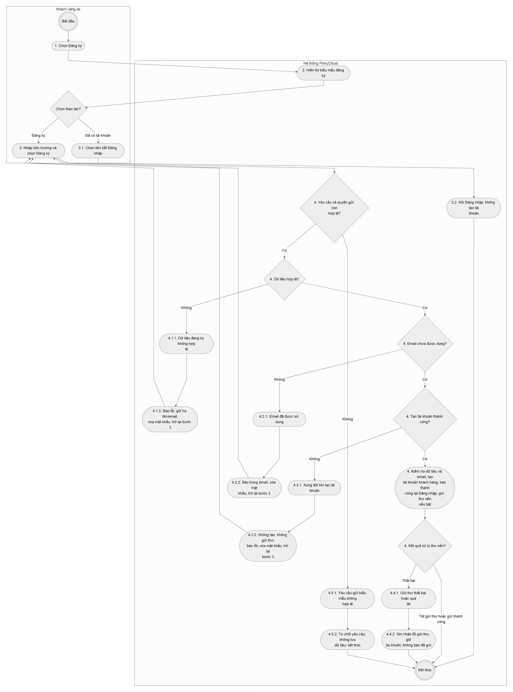

[SVG phóng to](assets/activity-auth-register.svg) · [Mã Mermaid](mermaid/activity-auth-register.mmd) · [Tài liệu sơ đồ](../../diagrams/activity-auth-register.md)

#### Sequence Diagram — Đăng ký tài khoản

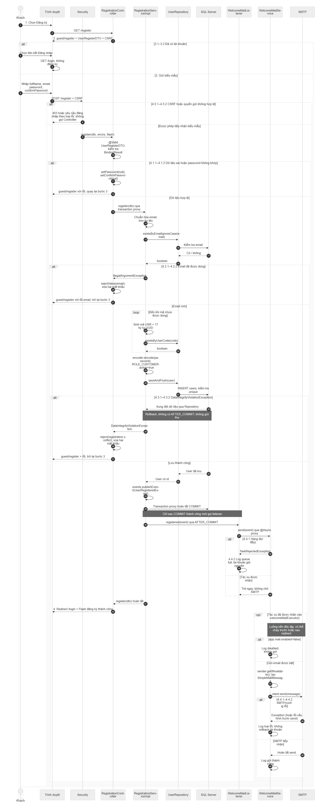

[SVG phóng to](assets/sequence-auth-register.svg) · [Mã Mermaid](mermaid/sequence-auth-register.mmd) · [Tài liệu sơ đồ](../../diagrams/auth-register.md)

Đặc tả nguồn: [uc006-auth-register](../../usecases/uc006-auth-register.md).

### 8.2.2. Đăng nhập

| Thành phần | Nội dung |
| --- | --- |
| **Tên use case** | Đăng nhập |
| **Mã use case** | uc005-auth-login |
| **Mô tả sơ lược** | Người dùng đăng nhập bằng email và mật khẩu để sử dụng chức năng phù hợp với vai trò khách hàng hoặc quản trị viên. |
| **Actor chính** | Khách vãng lai có tài khoản |
| **Actor phụ** | Không |
| **Tiền điều kiện (Pre-condition)** | Người dùng có tài khoản đã đăng ký hoặc được quản trị hệ thống khởi tạo; truy cập được màn hình Đăng nhập. |
| **Hậu điều kiện (Post-condition)** | Thành công: người dùng được nhận diện với quyền của tài khoản; khách hàng về trang chủ, quản trị viên vào danh sách người dùng. Thất bại: không cấp quyền đăng nhập mới. |

#### Luồng sự kiện chính (Main flow):

| Actor | Hệ thống |
| --- | --- |
| 1. Mở chức năng Đăng nhập. |  |
|  | 2. Hiển thị biểu mẫu email và mật khẩu. |
| 3. Nhập email, mật khẩu và chọn Đăng nhập. |  |
|  | 4. Kiểm tra email và mật khẩu, yêu cầu tài khoản đang hoạt động. Khi tài khoản là khách hàng, cho phép đăng nhập và hiển thị trang chủ. |

#### Luồng sự kiện thay thế (Alternate Flow):

| Actor | Hệ thống |
| --- | --- |
| 3.1. Chọn Đăng ký khi chưa có tài khoản. |  |
|  | 3.2. Mở biểu mẫu Đăng ký; kết thúc use case Đăng nhập. |
|  | 4.1. Xác định tài khoản hợp lệ có quyền quản trị viên. |
|  | 4.2. Cho phép đăng nhập và hiển thị danh sách người dùng; kết thúc use case. |

#### Luồng sự kiện ngoại lệ (Exception Flow):

| Actor | Hệ thống |
| --- | --- |
|  | 4.1.1. Không tìm thấy email, mật khẩu không đúng hoặc tài khoản đã bị khóa. |
|  | 4.1.2. Hiển thị lại Đăng nhập với thông báo “Email, mật khẩu không đúng hoặc tài khoản đã bị khóa.” Quay lại bước 3. |
|  | 4.2.1. Yêu cầu gửi từ biểu mẫu không còn hợp lệ hoặc không thể xác thực nguồn gửi. |
|  | 4.2.2. Từ chối yêu cầu; không đăng nhập. Người dùng cần mở lại Đăng nhập ở bước 1 trước khi thử lại. |

#### Activity Diagram — Đăng nhập

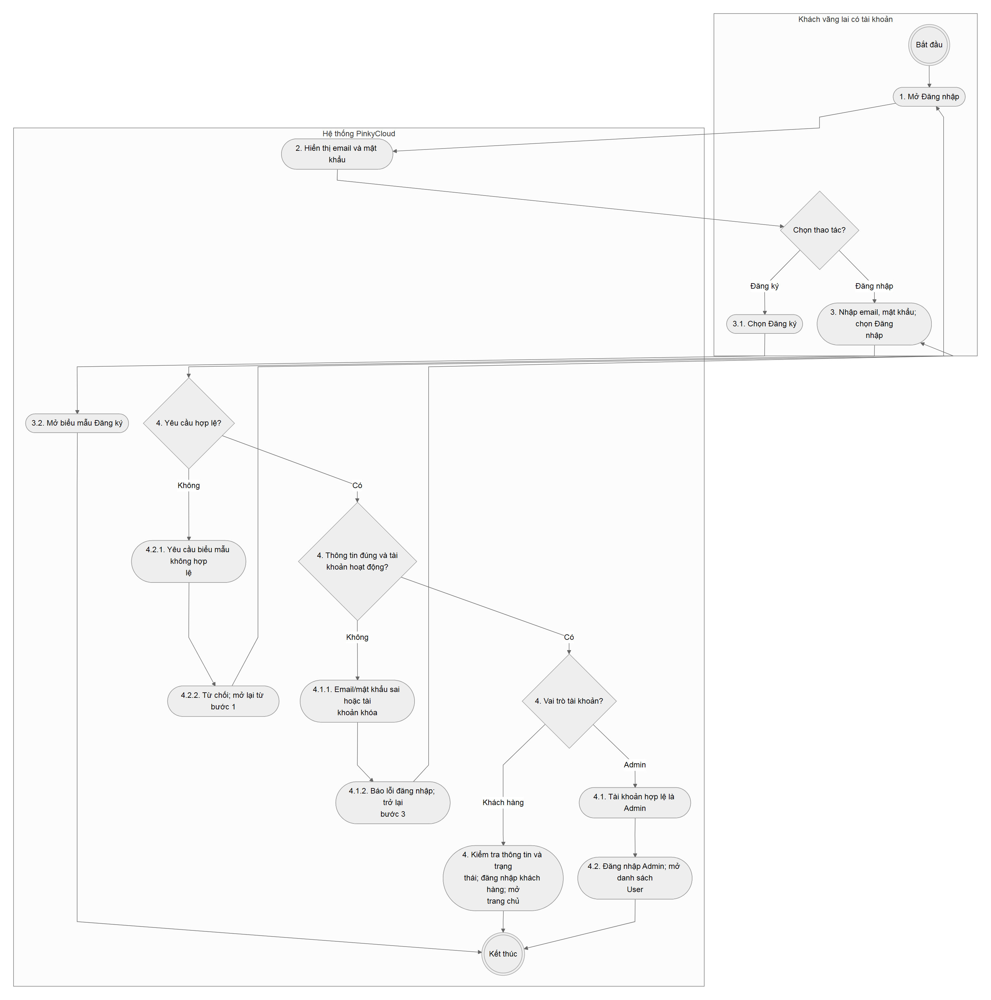

[SVG phóng to](assets/activity-auth-login.svg) · [Mã Mermaid](mermaid/activity-auth-login.mmd) · [Tài liệu sơ đồ](../../diagrams/activity-auth-login.md)

#### Sequence Diagram — Đăng nhập

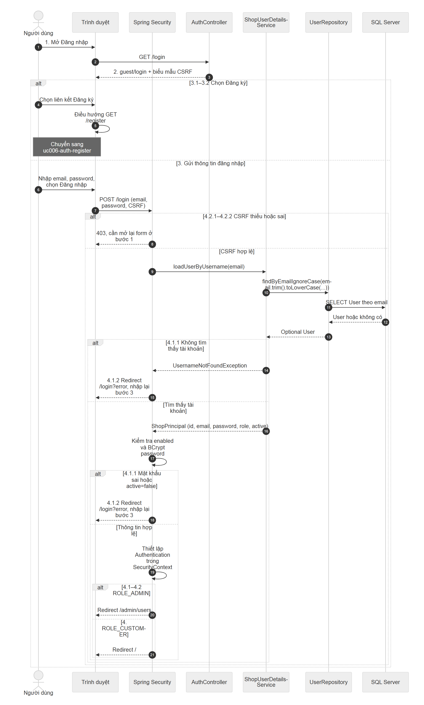

[SVG phóng to](assets/sequence-auth-login.svg) · [Mã Mermaid](mermaid/sequence-auth-login.mmd) · [Tài liệu sơ đồ](../../diagrams/auth-login.md)

Đặc tả nguồn: [uc005-auth-login](../../usecases/uc005-auth-login.md).

### 8.2.3. Đăng xuất

| Thành phần | Nội dung |
| --- | --- |
| **Tên use case** | Đăng xuất |
| **Mã use case** | uc008-auth-logout |
| **Mô tả sơ lược** | Người dùng kết thúc lần đăng nhập hiện tại trên trình duyệt đang sử dụng. |
| **Actor chính** | Khách hàng hoặc Admin |
| **Actor phụ** | Không |
| **Tiền điều kiện (Pre-condition)** | Người dùng đã đăng nhập và nhìn thấy nút Đăng xuất. |
| **Hậu điều kiện (Post-condition)** | Thành công: quyền truy cập của lần đăng nhập hiện tại bị xóa; màn hình Đăng nhập hiển thị “Bạn đã đăng xuất.” Các lần đăng nhập ở trình duyệt khác không thuộc phạm vi thao tác này. |

#### Luồng sự kiện chính (Main flow):

| Actor | Hệ thống |
| --- | --- |
| 1. Chọn nút Đăng xuất. |  |
|  | 2. Kiểm tra yêu cầu hợp lệ, kết thúc lần đăng nhập hiện tại và chuyển tới Đăng nhập với thông báo “Bạn đã đăng xuất.” |

#### Luồng sự kiện thay thế (Alternate Flow):

| Actor | Hệ thống |
| --- | --- |
| 1.1. Không chọn Đăng xuất và tiếp tục sử dụng chức năng khác. |  |
|  | 1.2. Không thực hiện đăng xuất; kết thúc use case này. |

#### Luồng sự kiện ngoại lệ (Exception Flow):

| Actor | Hệ thống |
| --- | --- |
|  | 2.1.1. Yêu cầu đăng xuất không hợp lệ hoặc biểu mẫu đã hết hiệu lực. |
|  | 2.1.2. Từ chối yêu cầu; không xác nhận đăng xuất thành công. Kết thúc use case; người dùng cần tải lại trang để xác định trạng thái đăng nhập. |

#### Activity Diagram — Đăng xuất

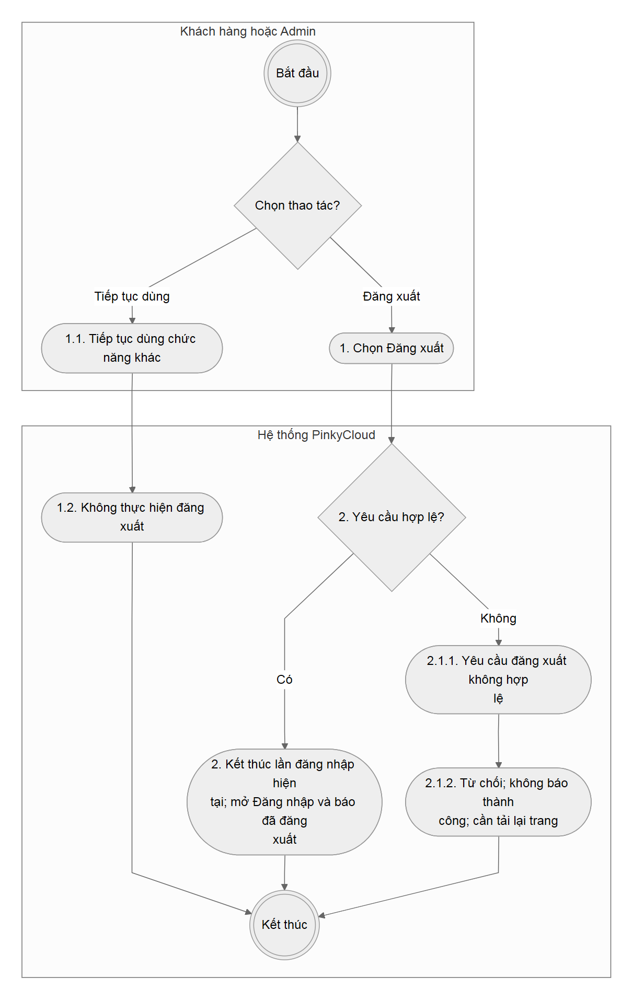

[SVG phóng to](assets/activity-auth-logout.svg) · [Mã Mermaid](mermaid/activity-auth-logout.mmd) · [Tài liệu sơ đồ](../../diagrams/activity-auth-logout.md)

#### Sequence Diagram — Đăng xuất

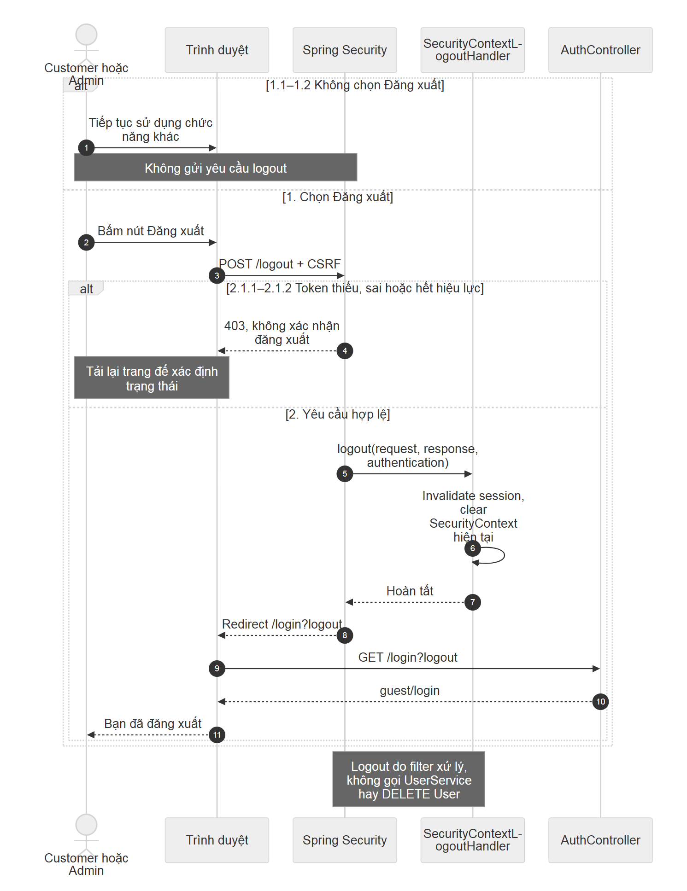

[SVG phóng to](assets/sequence-auth-logout.svg) · [Mã Mermaid](mermaid/sequence-auth-logout.mmd) · [Tài liệu sơ đồ](../../diagrams/auth-logout.md)

Đặc tả nguồn: [uc008-auth-logout](../../usecases/uc008-auth-logout.md).

## 8.3. Đặc tả quản lý người dùng

### 8.3.1. Xem, tìm kiếm và phân trang người dùng

| Thành phần | Nội dung |
| --- | --- |
| **Tên use case** | Xem, tìm kiếm và phân trang người dùng |
| **Mã use case** | uc007d-admin-view-users |
| **Mô tả sơ lược** | Admin tra cứu người dùng theo mã, họ tên hoặc email và xem từng trang kết quả. |
| **Actor chính** | Admin |
| **Actor phụ** | Không |
| **Tiền điều kiện (Pre-condition)** | Admin đã đăng nhập bằng tài khoản đang hoạt động và có quyền quản trị người dùng. |
| **Hậu điều kiện (Post-condition)** | Danh sách hiển thị đúng tiêu chí hợp lệ; không thay đổi thông tin người dùng và không hiển thị mật khẩu. |

#### Luồng sự kiện chính (Main flow):

| Actor | Hệ thống |
| --- | --- |
| 1. Mở mục Người dùng trong khu vực quản trị. |  |
|  | 2. Kiểm tra quyền truy cập và hiển thị trang đầu gồm tối đa 10 người dùng, xếp mới nhất trước; mỗi dòng có mã, họ tên, email, điện thoại, vai trò và trạng thái hoạt động. |
| 3. Nhập từ khóa theo mã, tên hoặc email rồi chọn Tìm kiếm; có thể chọn số dòng mỗi trang hoặc chuyển trang. |  |
|  | 4. Kiểm tra từ khóa tối đa 100 ký tự, số dòng từ 1 đến 100 và trang không âm; tìm không phân biệt hoa thường, hiển thị danh sách phù hợp cùng điều khiển phân trang. |

#### Luồng sự kiện thay thế (Alternate Flow):

| Actor | Hệ thống |
| --- | --- |
| 3.1. Để trống từ khóa và chọn Tìm kiếm. |  |
|  | 3.2. Hiển thị lại tất cả người dùng theo phân trang. Quay lại bước 3 nếu cần tra cứu tiếp. |
|  | 4.1. Không có người dùng khớp từ khóa. |
|  | 4.2. Hiển thị danh sách rỗng; Admin có thể đổi tiêu chí ở bước 3. |
|  | 4.3. Trang yêu cầu không còn dữ liệu, chẳng hạn sau khi xóa dòng cuối của trang. |
|  | 4.4. Hiển thị trang cuối còn dữ liệu, hoặc trang đầu rỗng nếu không còn kết quả. Kết thúc lần tra cứu. |

#### Luồng sự kiện ngoại lệ (Exception Flow):

| Actor | Hệ thống |
| --- | --- |
|  | 2.1.1. Người truy cập chưa đăng nhập, tài khoản không còn hợp lệ hoặc không có quyền quản trị. |
|  | 2.1.2. Yêu cầu đăng nhập lại nếu chưa đăng nhập hoặc tài khoản hết hiệu lực; từ chối truy cập nếu đã đăng nhập nhưng không có quyền. Kết thúc use case. |
|  | 4.1.1. Từ khóa quá dài, số dòng ngoài 1–100 hoặc số trang âm. |
|  | 4.1.2. Thông báo bộ lọc không hợp lệ và hiển thị dữ liệu với tiêu chí mặc định: từ khóa trống, trang đầu, 10 dòng. Admin sửa tiêu chí ở bước 3. |

#### Activity Diagram — Xem, tìm kiếm và phân trang người dùng

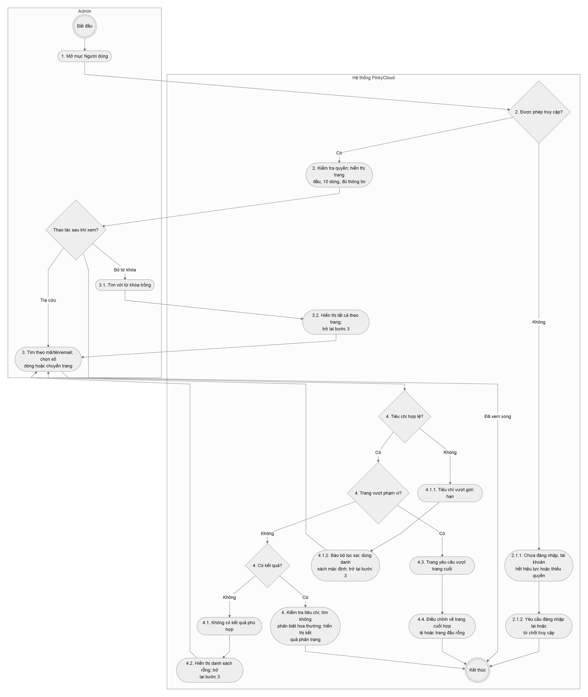

[SVG phóng to](assets/activity-admin-view-users.svg) · [Mã Mermaid](mermaid/activity-admin-view-users.mmd) · [Tài liệu sơ đồ](../../diagrams/activity-admin-view-users.md)

#### Sequence Diagram — Xem, tìm kiếm và phân trang người dùng

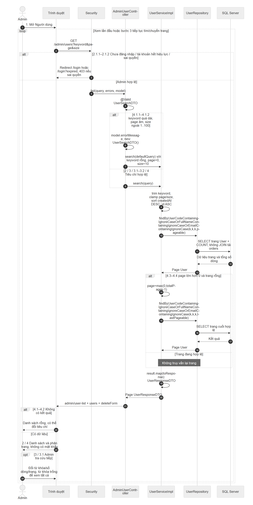

[SVG phóng to](assets/sequence-admin-view-users.svg) · [Mã Mermaid](mermaid/sequence-admin-view-users.mmd) · [Tài liệu sơ đồ](../../diagrams/admin-view-users.md)

Đặc tả nguồn: [uc007d-admin-view-users](../../usecases/uc007d-admin-view-users.md).

### 8.3.2. Cập nhật thông tin và trạng thái người dùng

| Thành phần | Nội dung |
| --- | --- |
| **Tên use case** | Cập nhật thông tin và trạng thái người dùng |
| **Mã use case** | uc007b-admin-update-user |
| **Mô tả sơ lược** | Admin sửa họ tên, email, điện thoại, địa chỉ và trạng thái hoạt động. Chức năng không cho đổi mã người dùng, mật khẩu hoặc vai trò. |
| **Actor chính** | Admin |
| **Actor phụ** | Không |
| **Tiền điều kiện (Pre-condition)** | Admin đã đăng nhập bằng tài khoản đang hoạt động và có quyền quản trị người dùng. |
| **Hậu điều kiện (Post-condition)** | Thành công: lưu các trường được phép sửa và hiển thị danh sách với thông báo cập nhật; khóa tài khoản có hiệu lực ở lần truy cập tiếp theo của người bị khóa. Thất bại hoặc hủy: không lưu thay đổi. |

#### Luồng sự kiện chính (Main flow):

| Actor | Hệ thống |
| --- | --- |
| 1. Chọn Sửa tại người dùng cần cập nhật trong danh sách. |  |
|  | 2. Kiểm tra quyền, tìm người dùng và hiển thị họ tên, email, điện thoại, địa chỉ, trạng thái hoạt động hiện tại trong biểu mẫu. |
| 3. Chỉnh họ tên, email, điện thoại, địa chỉ hoặc trạng thái hoạt động rồi chọn Lưu. |  |
|  | 4. Kiểm tra họ tên bắt buộc và tối đa 100 ký tự; email bắt buộc, đúng định dạng, tối đa 100 ký tự, không trùng tài khoản khác (không phân biệt hoa thường); điện thoại tùy chọn tối đa 20 ký tự, chỉ gồm chữ số, dấu cộng, khoảng trắng, ngoặc và gạch nối; địa chỉ tùy chọn tối đa 255 ký tự; trạng thái phải được xác định. Chặn tự khóa và khóa Admin hoạt động cuối cùng. Lưu thông tin, chuyển về danh sách và báo “Đã cập nhật người dùng.” |

#### Luồng sự kiện thay thế (Alternate Flow):

| Actor | Hệ thống |
| --- | --- |
| 3.1. Chọn Hủy thay vì lưu. |  |
|  | 3.2. Trở về danh sách, không lưu thay đổi; kết thúc use case. |

#### Luồng sự kiện ngoại lệ (Exception Flow):

| Actor | Hệ thống |
| --- | --- |
|  | 2.1.1. Người truy cập chưa đăng nhập, tài khoản không còn hợp lệ hoặc không có quyền quản trị. |
|  | 2.1.2. Yêu cầu đăng nhập lại nếu chưa đăng nhập hoặc tài khoản hết hiệu lực; từ chối truy cập nếu đã đăng nhập nhưng không có quyền. Kết thúc use case. |
|  | 2.2.1. Người dùng không tồn tại khi mở biểu mẫu. |
|  | 2.2.2. Trở về danh sách và báo không tìm thấy người dùng; kết thúc use case. |
|  | 4.1.1. Dữ liệu nhập thiếu hoặc không đạt các giới hạn tại bước 4. |
|  | 4.1.2. Giữ nội dung biểu mẫu và báo lỗi cạnh trường tương ứng. Quay lại bước 3. |
|  | 4.2.1. Email đã thuộc tài khoản khác hoặc phát sinh xung đột thông tin khi lưu. |
|  | 4.2.2. Không lưu; giữ biểu mẫu, hiển thị thông báo kiểm tra email. Quay lại bước 3. |
|  | 4.3.1. Admin chọn khóa chính tài khoản đang dùng hoặc khóa Admin hoạt động cuối cùng. |
|  | 4.3.2. Không lưu; giữ biểu mẫu và thông báo rõ quy tắc bị vi phạm. Quay lại bước 3. |
|  | 4.4.1. Người dùng đã bị xóa trước khi lưu thay đổi. |
|  | 4.4.2. Trở về danh sách, báo không tìm thấy người dùng; kết thúc use case. |
|  | 4.5.1. Yêu cầu gửi biểu mẫu không hợp lệ, hoặc quyền hay trạng thái tài khoản không còn hợp lệ khi gửi. |
|  | 4.5.2. Từ chối thao tác; yêu cầu đăng nhập lại nếu chưa đăng nhập hoặc tài khoản hết hiệu lực. Không lưu dữ liệu. Kết thúc use case; Admin cần mở lại chức năng bằng tài khoản hợp lệ. |

#### Activity Diagram — Cập nhật thông tin và trạng thái người dùng

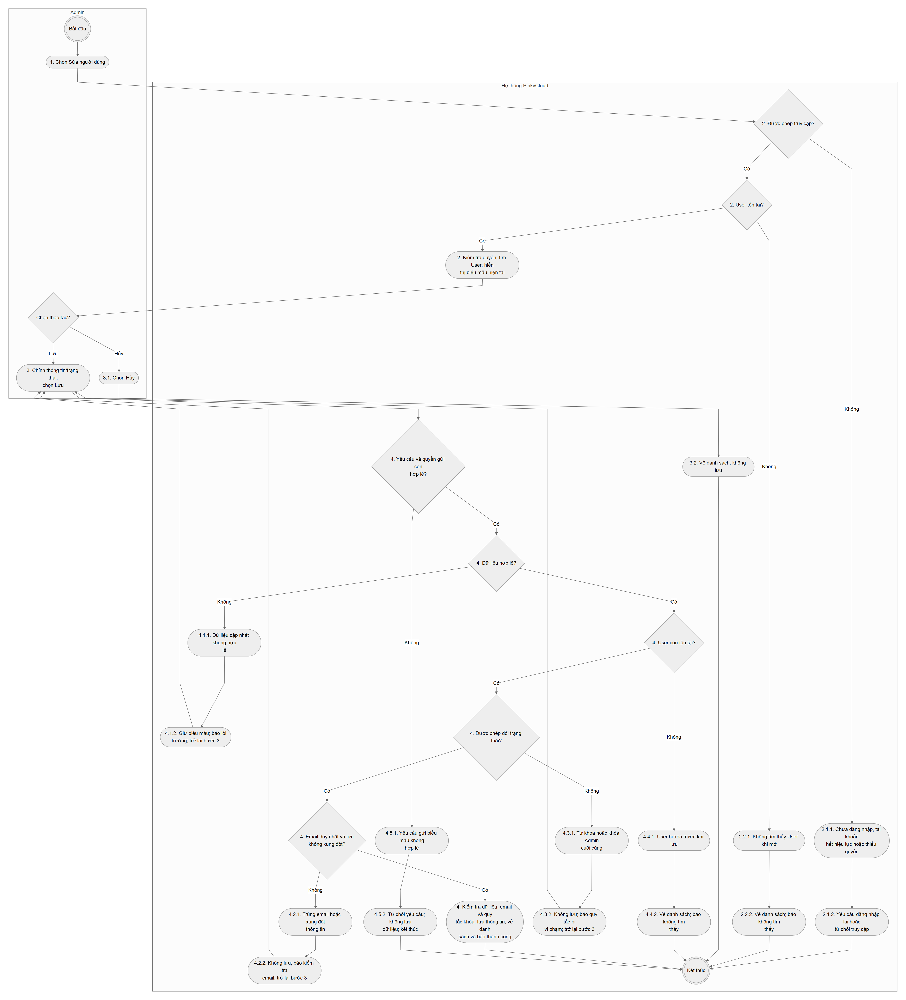

[SVG phóng to](assets/activity-admin-update-user.svg) · [Mã Mermaid](mermaid/activity-admin-update-user.mmd) · [Tài liệu sơ đồ](../../diagrams/activity-admin-update-user.md)

#### Sequence Diagram — Cập nhật thông tin và trạng thái người dùng

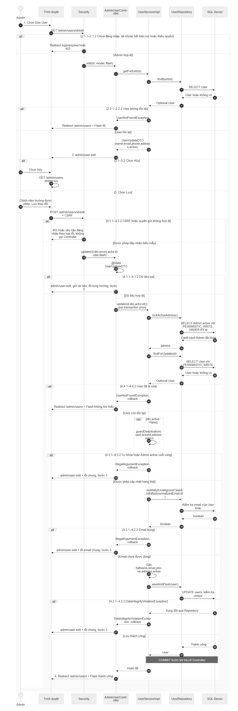

[SVG phóng to](assets/sequence-admin-update-user.svg) · [Mã Mermaid](mermaid/sequence-admin-update-user.mmd) · [Tài liệu sơ đồ](../../diagrams/admin-update-user.md)

Đặc tả nguồn: [uc007b-admin-update-user](../../usecases/uc007b-admin-update-user.md).

### 8.3.3. Xóa người dùng

| Thành phần | Nội dung |
| --- | --- |
| **Tên use case** | Xóa người dùng |
| **Mã use case** | uc007c-admin-delete-user |
| **Mô tả sơ lược** | Admin xóa vĩnh viễn người dùng sau khi xác nhận trong hộp thoại ngay trên danh sách. Cấm xóa người dùng đã có bất kỳ đơn hàng nào, kể cả đơn đã hủy. |
| **Actor chính** | Admin |
| **Actor phụ** | Không |
| **Tiền điều kiện (Pre-condition)** | Admin đã đăng nhập bằng tài khoản đang hoạt động và có quyền quản trị người dùng. Admin đang xem danh sách người dùng. |
| **Hậu điều kiện (Post-condition)** | Thành công: người dùng bị xóa, danh sách giữ tiêu chí hợp lệ và thông báo kết quả một lần; nếu trang vừa rỗng thì hiển thị trang hợp lệ gần nhất. Hủy hoặc bị từ chối: người dùng và đơn hàng giữ nguyên. Không chuyển sang ẩn tài khoản để vượt quy tắc xóa. |

#### Luồng sự kiện chính (Main flow):

| Actor | Hệ thống |
| --- | --- |
| 1. Chọn Xóa tại người dùng muốn xóa trong danh sách. |  |
|  | 2. Hiển thị hộp thoại xác nhận ngay trên danh sách, nêu đúng họ tên và mã người dùng cùng hai nút Hủy và Xóa; chưa thực hiện xóa. |
| 3. Kiểm tra đúng người dùng và chọn Xóa trong hộp thoại để xác nhận. |  |
|  | 4. Kiểm tra quyền và xác nhận hợp lệ, người dùng còn tồn tại, không phải tài khoản đang dùng hoặc Admin hoạt động cuối cùng; kiểm tra người dùng chưa có đơn ở mọi trạng thái. Xóa người dùng, hiển thị lại danh sách giữ bộ lọc/số dòng và điều chỉnh trang nếu cần, báo “Đã xóa người dùng.” |

#### Luồng sự kiện thay thế (Alternate Flow):

| Actor | Hệ thống |
| --- | --- |
| 3.1. Chọn Hủy hoặc nhấn Escape khi hộp thoại đang mở. |  |
|  | 3.2. Đóng hộp thoại, trả vị trí thao tác về nút đã mở; không gửi yêu cầu xóa. Kết thúc use case. |
| 3.3. Bấm Xóa lặp lại khi yêu cầu xác nhận đang được xử lý. |  |
|  | 3.4. Không gửi thêm yêu cầu từ cùng biểu mẫu; tiếp tục chờ kết quả của bước 4. |

#### Luồng sự kiện ngoại lệ (Exception Flow):

| Actor | Hệ thống |
| --- | --- |
|  | 4.1.1. Yêu cầu thiếu xác nhận, bộ lọc gửi kèm vượt giới hạn hoặc không còn được phép thực hiện thao tác. |
|  | 4.1.2. Không xóa. Nếu xác nhận/bộ lọc sai, trở về danh sách mặc định và báo “Yêu cầu xóa không hợp lệ. Vui lòng mở lại hộp xác nhận.” Nếu chưa đăng nhập hoặc tài khoản hết hiệu lực, yêu cầu đăng nhập lại; nếu thiếu quyền hoặc biểu mẫu không hợp lệ về nguồn gửi thì từ chối truy cập. Kết thúc use case. |
|  | 4.2.1. Người dùng không còn tồn tại, ví dụ đã bị xóa bởi yêu cầu trước. |
|  | 4.2.2. Trở về danh sách giữ bộ lọc hợp lệ và báo không tìm thấy người dùng; kết thúc use case. |
|  | 4.3.1. Đích xóa là chính tài khoản Admin đang dùng hoặc Admin hoạt động cuối cùng. |
|  | 4.3.2. Không xóa; trở về danh sách giữ bộ lọc và thông báo rõ quy tắc bị vi phạm; kết thúc use case. |
|  | 4.4.1. Người dùng có ít nhất một đơn hàng, bao gồm đơn đã hủy. |
|  | 4.4.2. Không xóa; trở về danh sách giữ bộ lọc và báo “Không thể xóa người dùng đã có đơn hàng, kể cả đơn đã hủy.” Kết thúc use case. |
|  | 4.5.1. Phát sinh dữ liệu liên quan hoặc thao tác cập nhật đồng thời khiến không thể hoàn tất xóa. |
|  | 4.5.2. Không xóa; trở về danh sách giữ bộ lọc, báo người dùng đang có dữ liệu liên quan hoặc đang được cập nhật và đề nghị tải lại/thử lại. Kết thúc use case. |

#### Activity Diagram — Xóa người dùng

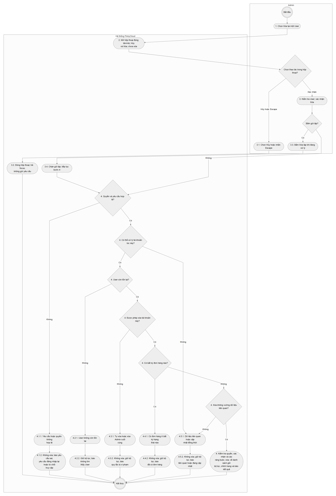

[SVG phóng to](assets/activity-admin-delete-user.svg) · [Mã Mermaid](mermaid/activity-admin-delete-user.mmd) · [Tài liệu sơ đồ](../../diagrams/activity-admin-delete-user.md)

#### Sequence Diagram — Xóa người dùng

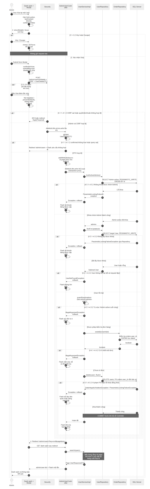

[SVG phóng to](assets/sequence-admin-delete-user.svg) · [Mã Mermaid](mermaid/sequence-admin-delete-user.mmd) · [Tài liệu sơ đồ](../../diagrams/admin-delete-user.md)

Đặc tả nguồn: [uc007c-admin-delete-user](../../usecases/uc007c-admin-delete-user.md).

## Phụ lục — Kiểm tra tài khoản hiện hành

Đây là cơ chế hỗ trợ, không phải mục tiêu riêng do người dùng khởi chạy. Khi tài khoản bị khóa/xóa hoặc email, vai trò, mật khẩu thay đổi, request tiếp theo đi qua bộ kiểm tra sẽ kết thúc lần đăng nhập cũ. Đổi họ tên đơn thuần không làm mất đăng nhập. Login/logout do các filter chuyên trách xử lý.

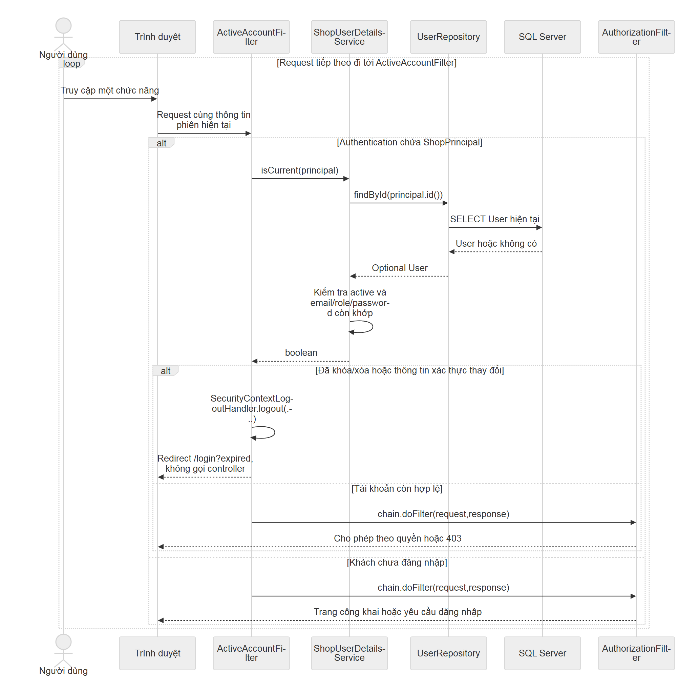

[SVG phóng to](assets/sequence-auth-current-account.svg) · [Mã Mermaid](mermaid/sequence-auth-current-account.mmd) · [Giải thích kỹ thuật](../../diagrams/auth-current-account.md).

## Ghi chú ghép và giới hạn

Xem [bảng đối chiếu với tài liệu nhóm](reconciliation.md) để thống nhất mã use case, điều kiện khởi tạo Admin, quyền checkout và các ràng buộc hồ sơ User. Đặc tả mô tả những nhánh đã đối chiếu với mã nguồn; không hứa mọi lỗi hạ tầng đều có xử lý thân thiện. Email được gửi nền sau khi tạo tài khoản; không bảo đảm người nhận đã nhận/đọc thư. Chức năng đổi vai trò, quên mật khẩu, Admin tạo User và xác minh email nằm ngoài phạm vi.

Kết quả kiểm tra sơ đồ và bản xuất được ghi riêng tại [verification.md](verification.md). Tác vụ tài liệu không phải một lần chạy lại kiểm thử ứng dụng.
